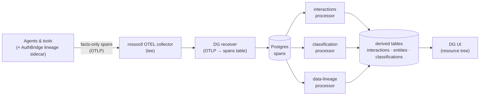

# Data Governance

Data-aware governance and security for the rossoctl agentic platform.
Data-governance (DG) observes how data flows across agents, tools, and
sessions: AuthBridge lineage sidecars emit facts-only spans for each HTTP hop,
DG ingests and stores them, and derives **interactions**, **payload
classifications**, and **data lineage** from the raw stream. The DG UI renders
the resulting per-request interaction forest so operators can see — and
eventually govern — how information moves through the system.

## Architecture

AuthBridge lineage sidecars emit two facts-only spans per HTTP exchange; the
DG receiver persists them, and the Layer-2 processors derive interactions,
classifications, and lineage that the UI renders. The full architecture is in
[`docs/PROJECT.md`](docs/PROJECT.md); the exact producer↔DG wire format is in
[`docs/sidecar-wire-contract.md`](docs/sidecar-wire-contract.md).



## Deploying data-governance

Everything runs on the local Kind cluster. The single entry point is
**`deploy/dg.sh`**, which installs, uninstalls, and reports status for the whole
DG component (Postgres, receiver, UI, the three processors, the UI HTTPRoute,
and the collector tee), and instruments a namespace's agents/tools for lineage.

> This guide covers installing **data-governance** and instrumenting a
> namespace. It assumes the rossoctl platform (the cluster, Istio Gateway, and
> OTEL collector) is already running — installing rossoctl itself is out of
> scope here.

### 1. Install the DG component

```sh
./deploy/dg.sh component install     # build + load + apply + tee + rollout
./deploy/dg.sh component status      # what's present/ready + is the tee wired
./deploy/dg.sh component uninstall   # the inverse (add --keep-data to keep the PVC)
```

`component install` is idempotent; add `--no-build` to skip the image build when
only manifests changed. It performs a `rollout restart` for you — this is
**load-bearing and easy to forget**: the manifests pin `:latest` with
`imagePullPolicy: IfNotPresent`, so `kubectl apply` alone will not cycle pods
onto a freshly-loaded image.

The per-manifest breakdown, per-workload topology, the NetworkPolicy security
boundary, the collector-tee mechanics, the raw step-by-step sequence, and the
migration-restart hazards are documented as deployment internals in
[`deploy/k8s/README.md`](deploy/k8s/README.md).

### 2. Instrument a namespace

To make DG observe a namespace, instrument its agents and tools for lineage:

```sh
./deploy/dg.sh namespaces list                 # namespaces DG can instrument
./deploy/dg.sh namespace <ns> instrument       # instrument every entity in <ns>
./deploy/dg.sh namespace <ns> instrument <e>   # instrument a single entity
./deploy/dg.sh namespace <ns> status           # instrumentation state of <ns>
```

Instrumentation is one-way and mode-preserving. Rossoctl-managed agents/tools
are selected by `rossoctl.io/type`, retain their enforcing sidecars and auth,
and are converged by rolling the application shim before hot-reloading the
proxy pipeline. `status` reports subsequent drift. The reasoning is recorded in
[ADR-0031](docs/adr/0031-non-reversible-namespace-lineage-activation.md) and
[ADR-0032](docs/adr/0032-dg-sh-builds-on-cortex-lineage-attach-kit.md), and the
CLI design in [`docs/cli.md`](docs/cli.md).

### 3. Worked example: the travel-advisor demo

The `travel_advisor` multi-agent demo (in the sibling `agent-examples` project)
is a convenient namespace to instrument end-to-end:

```sh
# 1. Deploy the demo into its namespace (see agent-examples/README-agent.md
#    for the full app-side playbook), then point DG at it:
./deploy/dg.sh namespace travel-advisor instrument

# 2. Run the demo from its dedicated demo-client pod (an external, un-instrumented caller):
kubectl -n travel-advisor exec deploy/demo-client -- python3 /app/app/demo.py

# 3. View the resulting trace in the DG UI:
#    http://dg.localtest.me:8080   (routed through the shared rossoctl Istio Gateway)
```

The UI landing page ("Recent traces") lists the run; click one to walk the
resource tree. The full demo runbook (deploying the app, the demo-client pod,
and the expected trace shape) lives with the `agent-examples` project.

## Configuration

- `DATABASE_URL` — Postgres DSN. Required for the `migrate` CLI and any caller
  of `data_governance.db`.
- `DB_POOL_MIN_SIZE` / `DB_POOL_MAX_SIZE` — connection-pool sizing (default 1 / 10).
- `DB_POOL_TIMEOUT` — seconds to wait for a connection from the pool before
  raising `PoolTimeout` (default 30).

## Where to go next

- [`docs/DEVELOPMENT.md`](docs/DEVELOPMENT.md) — local dev: tooling, running
  tests, repo layout, the two-span lineage pipeline, and loading traces/fixtures.
- [`deploy/k8s/README.md`](deploy/k8s/README.md) — deployment internals and the
  raw manifest-level procedure.
- [`docs/PROJECT.md`](docs/PROJECT.md) — full architecture.
- [`docs/sidecar-wire-contract.md`](docs/sidecar-wire-contract.md) — the
  producer↔DG wire format.
- [`CONTEXT.md`](CONTEXT.md) and [`docs/adr/`](docs/adr/) — the domain glossary
  and architecture decision records.
