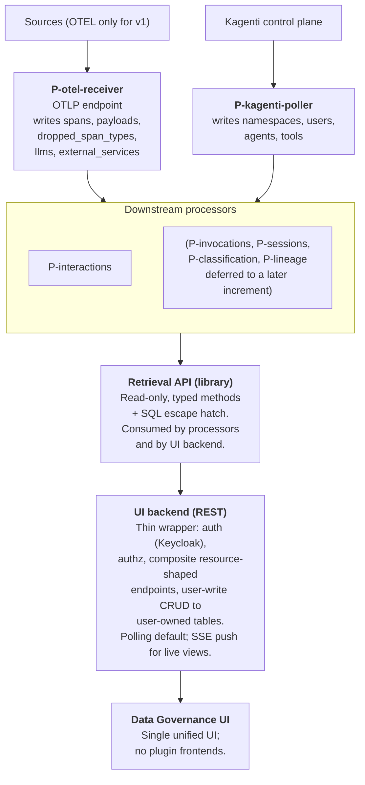

# Data Governance for Kagenti — Architecture (v2)

## Introduction

The data governance service aims to ensure data is accurate, secure, and used responsibly throughout an organization. It serves to establish visibility and control over how data flows through agents, tools, and systems. 

The primary objectives of data governance are:

- **Ensure data quality, transparency and traceability** — Maintain reliable information by tracking and recording how data flows through the system, and provide data lineage and classification so stakeholders understand how and what information moves through the system.
- **Detect data-related vulnerabilities and risks** — Identify and alert on potential vulnerabilities and policy violations (before they impact operations).
- **Enable compliance and remediation** - Provide clear explanations, remediation guidance and enforcement suggestions on policy violations.

## Guiding principles

- Minimal changes to the Kagenti platform itself.
- Loosely coupled with Kagenti.
- Build on existing open source (UDC for classification, OpenTelemetry /
  OpenInference for events, Postgres for storage, OPA/Rego as a likely
  first policy-plugin runtime).
- Use Kagenti's capabilities to pull information about installed agents,
  tools, namespaces, users.
- Store only raw events that are beneficial for later analytics.
- Raw events are normalized to a unified representation.
- Analytics work over raw events *and* a higher-level retrieval API.

## High-level architecture



`P-otel-receiver` is a trivial processor: it owns the OTLP socket,
class-filters incoming spans, logs `dropped_span_types`, and extracts
derived entities (`llms`, `external_services`) at first sighting.

`P-kagenti-poller` pulls authoritative entity info from the Kagenti
control plane.

Downstream processors are realtime; they read via the retrieval API
and mutate their own outputs when upstream rows change. Cursors are on
`change_seq` (insert+update aware); LISTEN/NOTIFY provides
push-latency.

## 1. Source and transport

- **Sources (v1): OTEL only.** The ingestion pipeline is
  source-pluggable in design, but only one source is implemented.
- **Transport: OTLP.** Kagenti's OTEL collector adds an exporter
  pointing at the data-governance ingestion endpoint. No other glue in
  the platform.
- **Auth-bridge sidecar is optional.** If present, it emits its own
  span with user attributes. Ingestion treats user identity as
  *enrichment*, not a join key — the pipeline works with or without
  the sidecar. Identity is joined at query time via trace_id.

## 2. Storage

- **Postgres** (as suggested by PROJECT.md).
- **No Phoenix dependency.** Ingestion is a parallel OTel sink; raw
  spans are stored by us, not read from Phoenix.

## 3. Span classification at ingest

Every incoming span is placed into exactly one of three classes, by
the rule: **a span is class-1 iff it either (a) creates a new
interaction or (b) adds significant information to an existing
interaction (a payload, a resolved entity identity, a timestamp) that
no other class-1 span in that interaction carries.** Class-2 is
structural-only. Class-3 is unknown.

| Class | Meaning | Stored? | Role in an interaction |
|-------|---------|---------|------------------------|
| 1 | Semantic event spans — spans that either create an interaction (the **topmost** class-1 span of the chain in the tree becomes the creator) or enrich one (other class-1 spans of the same chain fill previously-NULL columns). Includes OpenInference AGENT/LLM/TOOL spans, A2A client/server anchors, and instrumented HTTP/DB/fs client spans that identify a real tool → target. | Yes — `spans` | `creator` or `enricher` |
| 2 | Structural connector spans — preserve the parent-chain but contribute no interaction-creating or interaction-enriching information (e.g. the A2A SDK's `a2a.server.events.*` event-queue cloud, MCP transport spans when the tool_target is identified elsewhere). | Yes — `spans` | `connector` |
| 3 | Everything not on any class-1 or class-2 allowlist (health probes, readiness checks, metrics scrape, unknown span names) | No — dropped at ingest; logged in `dropped_span_types` | N/A |

- Class-1 spans either create a new interaction or join an existing one
  per the chain-catalog rule in §8.
- Class-2 spans cannot create an interaction on their own; they attach
  to the nearest class-1 ancestor's interaction as connectors.
- **All class-2 spans are connectors — none are dropped or unlinked.**
  SDK-internal plumbing (the `a2a.server.events.*` cloud, MCP transport
  spans, `a2a.server.request_handlers.default_request_handler.*`, etc.)
  is bulky — a single A2A call can drag ~50–100 connector spans along
  — but they are kept in full. Two reasons: (1) dropping them would
  break `parent_id` walks in P-interactions (the
  `a2a`-filter-broke-the-tree incident), and (2) the UI does not render
  interactions as expanded span trees. The topology view shows edges
  between entities; a detail panel lists the raw spans of a selected
  edge on demand. Connector volume therefore does not pollute the
  primary UI.
- **Classification is predicate-based, not name-based.** Span names in
  the wild are unreliable discriminators: OpenInference-instrumented
  agent frameworks emit wildly different names for the same semantic
  event (`generation`, `ChatOpenAI`, `call_llm` are all LLM spans;
  `book_flight`, `delegate_to_research_agent`, `agent` are all tool or
  agent spans), while the reliable discriminator is the
  `openinference.span.kind` attribute. HTTP client spans have generic
  names (`POST /`, `POST /mcp`) that need attribute filters
  (`server.address`, `url.full`) to tell a real T2E egress apart from
  internal A2A/MCP plumbing. Therefore the allowlists are expressed as
  **predicates** over `(span_name, span_kind, attributes,
  service_name, nearest_class1_ancestor)`, not as sets of names. See
  §8 on the `Anchor` shape.
- **Class-1 disambiguation requires ancestor context, so it happens
  in P-interactions, not P-otel-receiver.** Some class-1 anchors
  (notably A2A client / server and generic HTTP client) need to
  consult their nearest class-1 ancestor to decide whether to match
  — e.g., A2A spans decline class-1 when nested inside a T2A
  delegation, see §8 "Preemption." The receiver therefore cannot
  finalise class-1 membership locally. Instead:
  - P-otel-receiver does *local* triage: class-3 (dropped, unknown)
    vs kept (class-1 candidate or class-2). Anything not matched by
    some local predicate in the allowlists is class-3 and dropped.
  - P-interactions runs the anchor predicates with ancestor context
    and finalises the decision. A class-1 candidate that declines
    due to ancestor context gets `interaction_spans(role=connector)`
    attached to the ancestor's interaction — exactly the class-2
    outcome.
  - Nothing is re-written in `spans`; the `class` column stored at
    ingest reflects the local triage verdict and is informational.
    The authoritative role is the one in `interaction_spans`.
- **The class-1 and class-2 allowlists are hardcoded Python modules,
  reviewed by PR.** Each entry is a predicate plus a brief semantic
  note: what the span represents, why it is class-1 or class-2, and
  (for class-1) a pointer to the resolver function that extracts
  source/destination entities from the span. Ultimate end-state: an
  exhaustive, semantically-documented allowlist covering every class-1
  and class-2 span the pipeline encounters. Changes go through code
  review so the `a2a`-filter-broke-the-tree incident is not repeated.
- **Spans matching no predicate default to class-3 (dropped).**
  Promoting a new span to class-1 or class-2 requires understanding its
  semantics first; a half-understood class-2 span actively pollutes the
  interaction graph by attaching as a connector in the wrong place.
  Unknown = dropped is the safe-until-reviewed posture.
- Class-3 is "everything no class-1 or class-2 predicate matches."

### Dropped-span-type detection

- `dropped_span_types(span_name, service_name, first_seen_at,
  last_seen_at, appearances_count, reviewed_at, reviewed_by, decision)`.
- Grain: `(span_name, service_name)` — same name from different
  services may have different semantics.
- On first-ever sighting of a new `(span_name, service_name)` the admin
  is notified (UI badge + digest). No alert per subsequent appearance
  — only the count is bumped.
- **Detect-only, no recovery.** Once a span name is approved as class-2
  (via a code-review allowlist PR), only *future* spans with that name
  are kept. Past spans remain dropped; any broken trace trees that
  resulted stay broken. This is an explicit non-goal.
- Best-effort: the pipeline keeps running through unknown span names.
  Admin reviews at their leisure.

### Unmatched class-1 spans

A class-1 span that runs through the chain catalog's predicates and
matches no anchor simply sits in `spans` with no `interaction_spans`
row. There is no quarantine table in v1: because P-interactions
re-examines free (unowned) spans in a neighbourhood on every span
arrival (§8), an unmatched class-1 span is naturally retried as more
spans land in its trace — if the chain catalog is later extended to
cover it, no admin action is required beyond the code-review PR.

Unmatched class-1 spans are not separately indexed or surfaced for
admin review in v1. If operational signal is needed later (e.g., "how
many class-1 spans never found a chain within their trace"), it can
be added as a periodic query over `spans LEFT JOIN interaction_spans`
without changing ingest.

## 4. Spans table and parent linkage

- Single append-only table: `spans`. (The earlier `raw_spans` /
  `computed_spans` split has been dropped.)
- `spans(trace_id, span_id, parent_id NULL, class, kind, name,
  service_name, started_at, ended_at, seq BIGINT, observed_at, ...,
  PRIMARY KEY (trace_id, span_id))`.
- **PK is composite `(trace_id, span_id)`**, not `span_id` alone.
  OTEL `span_id` is 8 bytes and only locally unique within a trace;
  two spans from different traces could in principle collide on
  `span_id`. Silently dropping a span on PK conflict is the worst
  failure mode (a class-1 span whose chain never resolves), so the
  PK is composite. Across the schema, every reference to a span
  carries `trace_id` alongside `span_id`.
- `parent_id` is **nullable and not a foreign key**. It stores
  whatever the OTEL span carried as `parent_span_id`, even if the
  referenced span has not yet arrived (or never arrives).
  Out-of-order arrival is absorbed naturally. The implicit
  `(trace_id, parent_id)` referent is always within the same trace.
- Only class-1 and class-2 spans are stored. Class-3 is dropped at
  ingest.
- **`P-otel-receiver` is trivial:** append spans, upsert derived
  entities (`llms`, `external_services`) at first sighting, bump
  counters in `dropped_span_types`. No parent-chain computation, no
  fix-pass, no cross-trace coordination.

### Indexes

- `(trace_id, span_id)` — PK, implicit. Serves upward walks
  (resolving a known `parent_id` within the same trace).
- `spans(trace_id, parent_id)` — for downward walks (finding children
  of a given span within a trace).

## 5. Retention

- Hard-drop class-3 at ingest.
- Class-1 and class-2 kept indefinitely in v1.
- Retention tiers and TTLs are a v2 concern; the class label is the
  place where tiering will attach when storage pressure warrants.

## 6. Payloads

- Separate `payloads` table keyed by `content_hash` (SHA-256 of
  normalized payload).
- Every span that carries a payload stores `*_hash` columns
  (e.g., `prompt_hash`, `completion_hash`, `tool_input_hash`,
  `tool_output_hash`) referencing `payloads.content_hash`. **A
  payload is a whole message** — the entire LLM prompt blob, the
  entire tool input, the entire A2A message body — not a
  decomposition into per-message parts. Per-message decomposition
  is a future change (it would raise dedup hit rates and let
  classification attribute findings to individual messages), but
  v1 keeps the simpler one-blob-per-`*_hash` shape.
- `payloads(content_hash PK, content, size_bytes, truncated_bytes
  BIGINT NULL, first_seen_at)`. `truncated_bytes` is NULL for
  payloads stored in full; otherwise it records the original
  pre-truncation size in bytes.
- Written by `P-otel-receiver` alongside `spans`, in the same
  transaction.
- **Normalization is byte-preserving.** When classification (§11)
  lands, UDC returns findings as `(offset, length, entity_type)`
  tuples into the stored `content`, so any normalization step must
  not shift offsets. Concretely: if the payload arrives as JSON,
  store it verbatim (no key-order canonicalization, no whitespace
  stripping); content-hash is taken over the bytes as-stored. Two
  semantically-equal payloads with different byte representations
  get two `payloads` rows, which is acceptable — dedup is a size
  optimization, not a correctness requirement.
- **Per-payload size cap (v1): 100 KB.** A single oversized payload
  must not blow ingest memory or pollute Postgres with multi-MB
  rows. On overflow:
  - Truncate to the first 100 KB and store that as `content`.
  - Set `truncated_bytes` to the original byte length.
  - `content_hash` is computed over the *truncated* bytes, so two
    different oversized payloads that share their first 100 KB
    will dedup — accepted; this is the same "byte-equality only"
    posture as the rest of §6.
  - Span keeps its `*_hash` column populated normally; consumers
    detect truncation via `payloads.truncated_bytes IS NOT NULL`.
  - When classification (§11) lands, findings on a truncated
    payload are explicitly partial — UDC sees only the first
    100 KB.
- **Overflow observability.** First sighting of a truncation per
  `(span_name, service_name)` is logged in
  `payload_overflow_events(span_name, service_name, first_seen_at,
  last_seen_at, count)` — same shape and treatment as
  `dropped_span_types` (§3): admin notification on first sighting,
  count-only thereafter.
- The 100 KB cap is provisional. §6 logs `size_bytes` on write so
  the distribution informs later tuning; raising or lowering the
  cap is a config change, not a schema change.

## 7. Entities

Entities are modeled as **per-kind typed tables**. A `entities` view
unions them for cross-kind queries. Per-kind tables:

- `namespaces` — authoritative, from Kagenti.
- `users` — authoritative, from Kagenti (backed by Keycloak). Humans.
- `agents` — authoritative, from Kagenti. Carries a `service_dns`
  column (in-cluster hostname / service address). Required for the
  reverse-lookup the T2A-vs-T2E and A2A-vs-A2E disambiguation depends
  on (§8).
- `tools` — authoritative, from Kagenti. Carries a `service_dns`
  column for the same reason as `agents`.
- `llms` — span-derived. Identity = `(provider, model_name)`.
  Optional `service_dns` / endpoint host, populated from the span
  when present, so the reverse-lookup "is this HTTP call hitting an
  LLM endpoint?" works when the OpenInference LLM span does not wrap
  its own HTTP client.
- `external_services` — span-derived. One row per observed external
  target system (filesystem, DB server, HTTP host, etc.). Identity =
  `(service_kind, identifier)` — `service_kind ∈ {http_host,
  db_server, fs_mount, ...}`, `identifier` kind-specific (host[:port]
  for `http_host`, etc.). Previously named `tool_targets`; renamed to
  `external_services` because both tools and agents can reach them
  (T2E and A2E interactions, §8). Fine-grained resource access
  (specific URLs, DB tables, files) stays on `interactions.details`,
  not in this table.

**Lifecycle columns:**

- K8s-sourced entities (`namespaces`, `users`, `agents`, `tools`):
  `valid_from`, `valid_until` (NULL = still active).
- Span-derived entities (`llms`, `external_services`): `first_seen_at`,
  `last_seen_at`. These never "disappear" — the UI can fade inactive
  nodes as a rendering choice, but there is no disappear event.

**Lifecycle model for K8s-sourced entities (versioned-row model):**

- `entity_id` is a per-row surrogate (UUID), **not** a stable logical
  identity. A delete-then-recreate of the same `(namespace, name)`
  produces a **new row with a new `entity_id`** and leaves the old
  row closed (`valid_until` set at the time of deletion).
- A logical "agent X" therefore corresponds to one or more `agents`
  rows ordered by `valid_from`. Joins from `interactions` always
  pin to the *specific historical version* that was active when the
  interaction occurred — chosen at write time by P-interactions
  using the row whose `(valid_from, valid_until]` contains the
  interaction's `request_at` (with NULL `valid_until` treated as
  +∞).
- Topology rendering merges versions by `(kind, namespace, name)` to
  show a single logical node per agent/tool, while the side panel can
  show per-version detail when a redeploy is interesting (e.g., for
  attributing behavior to a specific image tag). The merge key is a
  rendering choice in the UI, not a schema concept.
- A redeploy that replaces a pod without deleting the Kagenti CR is
  *not* a new row — that is a within-version observation. Only
  CR-level lifecycle transitions (create / delete) generate row
  boundaries. The discriminator P-kagenti-poller uses to detect
  "same logical entity, new row vs. continuing row" is the CR's
  resourceVersion-bracketed identity (`uid` from the K8s object
  metadata): a fresh `uid` after a previous delete is a new row; a
  stable `uid` across pod restarts is the same row.
- Past `interactions` referencing a now-closed row remain valid
  forever. `valid_until` is **not** a soft-delete; it does not hide
  the row from joins.
- Namespace deletion sets `valid_until` on the namespace row only.
  Agents/tools within that namespace are closed by their own
  observation when P-kagenti-poller next sees them gone — not
  cascade-closed.

**Target granularity (for `external_services` and resource-level
analytics):**

- `external_services` is coarse-grained — one row per *system*
  (filesystem, DB server, HTTP host).
- Fine-grained resource access (specific files, tables, paths) lives
  on T2E / A2E `interactions` rows: `dst_entity_id` points at the
  coarse `external_services` row, and `details` jsonb carries
  `resource_kind`, `resource_id`, `operation`, `status`.
- Resource-level analytics are aggregations over `interactions`, not a
  table.

**Discovery:** span-derived targets use "first seen from a span" only —
no external inventory feeds.

## 8. Interactions (observed edges)

Replaces the earlier `edges` term. An interaction is **one observed,
directed edge** in the graph — e.g., agent A calling agent B once, or
agent A invoking the LLM once. A single interaction can be backed by
**N spans** (N ≥ 1). The canonical N=2 case is an A2A call: the caller
emits a client-side span and the callee emits a server-side span; both
describe the same edge and therefore belong to the same interaction.

### Interaction kinds (closed enum)

`kind ∈ {A2A, A2L, A2T, A2E, T2A, T2E, U2A}`. New kinds are added by
code review alongside a chain definition (below) and a span-entity
resolver.

| Kind | Meaning | Source entity | Destination entity |
|------|---------|---------------|--------------------|
| `A2A` | Agent → agent via A2A protocol | agent | agent |
| `A2L` | Agent → LLM | agent | llm |
| `A2T` | Agent → Kagenti-registered tool | agent | tool |
| `A2E` | Agent → external service (not a Kagenti-registered entity) | agent | external_service |
| `T2A` | Tool → agent (tool invokes an agent, e.g. delegation or agent-shaped callback) | tool | agent |
| `T2E` | Tool → external service | tool | external_service |
| `U2A` | UI / user → agent | user | agent |

Because `T2A`'s destination is an agent, T2A interactions will
become **invocation roots** when §9 is reintroduced — a tool
delegating to an agent opens a new invocation, with the enclosing
agent-invocation (via the A2T that called the tool) supplying
`parent_invocation_id`.

**A2E is defined for completeness.** The v1 demo does not exercise it
(agents in the demo reach external services only via tools), but
custom agents that make direct external HTTP calls will produce A2E
interactions, so the kind is in the enum.

### Chain catalog

The chain catalog is a **pure-code Python module**, reviewed by PR,
that enumerates how class-1 spans combine into interactions. A chain
is a **set of class-1 anchors** that all belong to the same
interaction; class-2 spans play no role in chain matching. No anchor
in a chain is pre-designated as "the creator" — among the class-1
spans matched to a chain within a free-span neighbourhood (§8
"P-interactions behavior"), the **topmost** one in the trace tree
(closest to the trace root) becomes the interaction's creator; every
other matched class-1 span of the same chain joins as an enricher.
Chains vary in how many anchors they list:

- **Multi-anchor chains** (e.g., A2A): a client-side anchor and a
  server-side anchor, matched by the chain, potentially with more
  class-1 anchors if a single A2A call carries distinct
  interaction-enriching information across several spans. The topmost
  anchor in the tree creates the interaction; the other(s) enrich it.
  For A2A in a normally-nested trace this is the client anchor, but
  the rule is tree-ordered, not hardcoded per chain.
- **Single-anchor chains** (A2L, A2T, most T2E/A2E, U2A): one anchor,
  which creates the interaction. No enrichers in v1 for these kinds.

**Anchors are predicates, not names.** An `Anchor` carries a `match`
predicate over `(span_name, span_kind, attributes, service_name)`.
This is forced by what real instrumentation emits:

- OpenInference-based frameworks (LangGraph, Google ADK, custom SDKs)
  give LLM and tool spans arbitrary names; the stable signal is the
  `openinference.span.kind` attribute.
- A2A SDK spans have stable dotted names from the Python package, so
  exact-name matching works *there*.
- HTTP client spans share generic names (`POST /`, `POST /mcp`) across
  very different call types; distinguishing real tool-to-target egress
  from internal A2A/MCP transport requires attribute filters on
  `server.address` or `url.full`.

Sketch of the updated shape (anchors for the v1 demo flow; concrete
predicate implementations live in the allowlist module). Each anchor
carries a `kind ∈ {client, server}` — single-party spans (LLM/tool
local execution) are encoded as `client` by convention; there is no
`local` value:

```python
Chain(interaction_kind="A2A",
      anchors=[
          Anchor(match=exact_name(
                   "a2a.client.transports.jsonrpc.JsonRpcTransport"
                   ".send_message_streaming"),
                 kind="client", resolver=resolve_a2a_client),
          Anchor(match=exact_name(
                   "a2a.server.request_handlers.jsonrpc_handler"
                   ".JSONRPCHandler.on_message_send_stream"),
                 kind="server", resolver=resolve_a2a_server),
      ])
Chain(interaction_kind="A2L",
      anchors=[Anchor(match=openinference_kind("LLM"),
                      kind="client", resolver=resolve_llm)])
Chain(interaction_kind="A2T",
      anchors=[Anchor(
          # TOOL spans EXCEPT those flagged as agent delegations
          match=openinference_kind("TOOL")
                 .and_not(attr_eq("kagenti.call.kind",
                                  "agent_consultation")),
          kind="client", resolver=resolve_tool)])
Chain(interaction_kind="T2A",
      # Delegation-style T2A: an OpenInference TOOL span carrying the
      # Kagenti-specific `kagenti.call.kind=agent_consultation` marker
      # is a tool-function that internally delegates to another agent
      # via A2A. This anchor preempts both A2T and A2A — the enclosed
      # A2A client/server spans become class-2 connectors of the T2A.
      anchors=[Anchor(
          match=openinference_kind("TOOL")
                 .and_(attr_eq("kagenti.call.kind",
                               "agent_consultation")),
          kind="client", resolver=resolve_t2a_delegation)])
Chain(interaction_kind="A2E",
      anchors=[Anchor(match=http_client_from_agent(),  # see below
                      kind="client", resolver=resolve_external_service)])
Chain(interaction_kind="T2E",
      anchors=[Anchor(match=http_client_from_tool(),  # see below
                      kind="client", resolver=resolve_external_service)])
Chain(interaction_kind="U2A",
      anchors=[Anchor(match=exact_name("kagenti.backend.chat_handler"),
                      kind="client", resolver=resolve_u2a)])
```

Matching is **strict** on the anchor predicate (and `SpanKind` where
paired, via the predicate). The chain catalog asserts nothing about
the class-2 spans sitting between or around the anchors — those
attach to the nearest class-1 ancestor's interaction as connectors
via §8's class-2 rule, regardless of whether any chain mentions them.

**Preemption by enclosing class-1 ancestor.** An anchor's predicate
receives, in addition to the span itself, a handle to the nearest
class-1 ancestor (if any) and the interaction that ancestor belongs
to. This is what allows a span that *would* otherwise be class-1 to
decline the classification when it is nested inside a specific kind
of interaction. Two concrete uses in v1:

- **A2A client / server anchors decline when nested in T2A
  delegation.** When the A2A client span
  (`a2a.client.transports.jsonrpc.JsonRpcTransport.send_message_streaming`)
  has a nearest class-1 ancestor whose interaction is T2A, the A2A
  anchor's predicate returns false — the span falls through to the
  class-2 allowlist (which covers the full `a2a.client.*` /
  `a2a.server.*` surface as connectors). Result: the T2A interaction
  owns the delegation; no A2A interaction is created; the A2A
  transport spans attach as connectors to the T2A interaction. No
  double-counting.
- **Generic HTTP-client T2E / A2E anchors decline when nested in an
  OpenInference LLM, TOOL, or A2A interaction.** An `httpx` span
  sitting under a `ChatOpenAI` LLM span, or under an OpenInference
  TOOL span that already captures the request/response, is a
  transport artifact of an interaction already owned higher up. The
  T2E / A2E anchor's predicate rejects it; the class-2 rule attaches
  it as a connector. This is the mechanism that keeps MCP transport
  and OpenAI egress from double-counting.

Preemption is a property of the anchor's predicate (a predicate that
consults its ancestor), not a new step in the P-interactions
algorithm. The algorithm itself is unchanged: anchor predicates run
over the span and its ancestor context; the outcome is either a
match (class-1) or no match (class-2 allowlist fallback, then
class-3 if unmatched there too).

**Note on T2E / A2E discrimination:** a single HTTP client
instrumentation emits the same span name for genuine
tool/agent-to-external-service egress *and* for A2A/MCP transport
hops that are internal plumbing. The T2E / A2E predicates therefore
need attribute filters (e.g., `server.address` not matching any known
agent / tool / LLM host, `url.full` path not beginning with `/mcp`
or matching the A2A JSON-RPC endpoint) to avoid double-counting
transport spans that are already covered by dedicated A2A / MCP /
LLM-span anchors above them in the tree. The emitter × destination
matrix that formalises this lives under "HTTP client spans" below;
the exact predicate content is an open question pending review of
the long tail.

### Span-entity resolvers

Each `Anchor` carries its resolver function as a field alongside its
`match` predicate. The resolver knows the span's attribute schema —
e.g., the resolver for HTTP-client anchors reads `url.full` /
`server.address` to identify the `external_service`; the resolver for
the A2A server-side anchor reads server-side attributes to identify
the callee agent. Because anchor, predicate, and resolver are
co-located in the chain catalog entry, "class-1 allowlist" and "chain
catalog" are effectively one document — the set of class-1 anchor
entries across all chains. Adding a new class-1 span means adding one
anchor entry (predicate + role + resolver) to the appropriate chain.

### HTTP client spans: emitter × destination disambiguation

A generic HTTP client span (e.g., from `httpx` / `requests` / `grpc`
instrumentation) can represent several semantically different edges.
The predicate distinguishes them by **emitter** (who emitted the
span; derived from `service_name` looked up against `agents` and
`tools`) and **destination** (`server.address` looked up against
`agents.service_dns`, `tools.service_dns`, `llms.service_dns`,
otherwise classified as external):

| emitter ↓ / dst → | known agent | known tool | known LLM endpoint | unknown (external) |
|---|---|---|---|---|
| agent | A2A *(dedicated SDK span usually preempts)* | A2T *(MCP transport usually class-2 under OpenInference TOOL)* | A2L *(OpenInference LLM span usually preempts)* | **A2E** |
| tool  | T2A | **anomaly** | **anomaly** | **T2E** |

Notes on the matrix:

- Cells marked *(preempts)* indicate that a higher-level dedicated
  class-1 span usually exists above the generic HTTP span, in which
  case the generic HTTP span is class-2 (connector) and does not
  itself form a class-1 anchor. The generic-HTTP-client chain only
  fires when no dedicated span bracketed the call.
- Tool → known tool and tool → known LLM endpoint are **anomalies**:
  tools in normal Kagenti usage do not directly hit other tools'
  service DNS or an LLM endpoint. See the anomaly path below.

### Anomaly path

When a class-1 span matches an anchor but its `(emitter_kind,
dst_kind)` combination is one the matrix has declared impossible, the
span is **not** written to `interactions` and produces no
`interaction_spans` row. Instead it is recorded in a separate
anomaly table:

- `interaction_anomalies(trace_id, span_id, anchor_kind,
  emitter_entity_kind, emitter_entity_id, dst_entity_kind,
  dst_entity_id, reason, first_seen_at,
  PRIMARY KEY (trace_id, span_id))`.
- Receives the same UI treatment as `dropped_span_types` (§3):
  first-sighting admin notification, count-only thereafter.
- Detect-only. No recovery — an anomaly row is not retroactively
  upgraded to an interaction if the matrix is later refined.

The span itself remains in `spans` (it was class-1, stored normally);
only the interaction construction is suppressed.

### Late-inventory caveat

The T2A-vs-T2E and A2A-vs-A2E discrimination depends on a
reverse-lookup against `agents` / `tools` / `llms` that happens inside
the anchor's predicate, not inside entity blocking. A span whose
destination DNS does not yet match any registered agent resolves as
T2E (or A2E) — a legitimate, writeable interaction kind — rather than
waiting in `interactions_pending` for a match that may never come.
Once written, the interaction's kind does not flip, so if
`P-kagenti-poller` later registers the agent, the past T2E row stays
T2E. Operational mitigation: monitor `P-kagenti-poller` cursor lag
(§14 cursor-lag signal) so late-registration windows stay tight.

### Schema

- `interactions(
     trace_id,
     interaction_id,
     parent_interaction_id NULL,
     kind enum,
     src_entity_id references entities (by kind),
     dst_entity_id references entities (by kind),
     request_at,
     response_at NULL,
     request_payload_hash NULL references payloads(content_hash),
     response_payload_hash NULL references payloads(content_hash),
     details jsonb,
     change_seq BIGINT,
     observed_at,
     PRIMARY KEY (trace_id, interaction_id))`. Composite PK matches
  §4: `interaction_id` is the creator's `span_id`, which is only
  unique within `trace_id`, so the interactions PK carries `trace_id`
  too. `parent_interaction_id` is implicitly within the same
  `trace_id` (interactions never cross traces in v1).
- `details jsonb` holds kind-specific scalars: A2A method name and
  contextId, A2L provider/model/tokens, A2T tool function name, T2E
  / A2E resource_kind/resource_id/status/operation, U2A session
  attribute.
  Promoted to columns later if query patterns warrant; indexed via
  `gin` on jsonb paths if needed.
- **No per-kind tables.** A single `interactions` table serves all
  kinds. Payload hashes and timestamps are common columns because
  every kind has them; everything else is in `details`.
- `interaction_spans(trace_id, interaction_id, span_id, role, kind,
  PRIMARY KEY (trace_id, span_id))` — link table. PK is `(trace_id,
  span_id)` matching §4 (a span belongs to at most one interaction;
  the composite key prevents cross-trace span_id collisions).
  `(trace_id, interaction_id)` references `interactions`. Role and
  kind are orthogonal:
  - **`role ∈ {creator, enricher, connector}`** — what the span does
    to the interaction.
    - `creator` — class-1; this span triggered the creation of the
      interaction. Exactly one per interaction. `span_id ==
      interactions.interaction_id`.
    - `enricher` — class-1; this span joined an already-existing
      interaction (same chain, a different anchor) and filled
      previously-NULL columns on `interactions` via its resolver.
      Zero or more per interaction.
    - `connector` — class-2; this span attaches structurally because
      its nearest class-1 ancestor belongs to this interaction. Zero
      or more per interaction.
  - **`kind ∈ {client, server}`** — which side of a distributed call
    this span represents. For dual-anchor chains (A2A), creator and
    enricher carry opposite kinds. For single-anchor chains (A2L, A2T,
    T2E, A2E, U2A), there is no distributed-call partner; the creator is
    `kind=client` by convention and there are no enrichers. For
    `connector` rows, `kind` is `client` by convention (a structural
    span has no meaningful client/server identity of its own).
- **`interaction_id`** is the span_id of the **creator** — the
  topmost class-1 anchor of the chain in the trace tree (§8 chain
  catalog). Order-independent: any triggering span that causes the
  same free-span neighbourhood to be evaluated produces the same
  creator, so `interaction_id` is stable under OTLP reordering.
  Stable once written — as further enricher or connector spans accrete
  into `interaction_spans`, the creator's identity does not change.
- `parent_interaction_id` points to the enclosing interaction (the
  interaction whose creator is the nearest class-1 ancestor of this
  interaction's creator). Nullable; NULL means the interaction is a
  root. Resolved at first write and never flipped later: the upward
  walk from the creator either reaches an already-written interaction
  (and pins `parent_interaction_id` to it) or reaches a trace root
  through free spans (and pins it to NULL for the chain just
  resolved). Because P-interactions only ever writes interactions
  whose creator is the topmost free class-1 anchor of its chain, the
  creator's nearest class-1 ancestor, if any, is necessarily owned by
  the enclosing interaction already.
- `request_at` / `response_at` are derived from the participating
  spans (client-side span's start/end for dual-anchor chains; sole
  span's start/end for single-anchor). `response_at` may be NULL if
  the call errored or its span did not record a response.

### Entity resolution and blocking

P-interactions resolves `src_entity_id` and `dst_entity_id` via the
span-entity resolver for each class-1 anchor. The resolver returns a
**logical entity reference** — `(kind, namespace, name)` for K8s
entities, `(provider, model_name)` for LLMs, `(service_kind,
identifier)` for external services. P-interactions then picks the
specific entity-row version that was active at `request_at`:
`SELECT entity_id FROM <kind> WHERE (namespace, name) = ($1, $2)
AND valid_from <= $request_at AND (valid_until IS NULL OR
valid_until > $request_at)`. Span-derived entities (`llms`,
`external_services`) are versionless; the same query collapses to a
match on identity columns.

If no entity row matches (typically because `P-kagenti-poller` has
not yet observed the agent/tool), the interaction is **not
written**; the span is recorded in a pending set:

- `interactions_pending(trace_id, span_id, blocked_on_kind,
  blocked_on_key, first_seen_at,
  PRIMARY KEY (trace_id, span_id))` — owned by P-interactions.
  `blocked_on_key` carries the logical reference (e.g., `(namespace,
  name)` for an agent), not an `entity_id` — `entity_id` is per-row
  and would not be known until the row exists.

P-interactions' execution model therefore has two triggers:

1. New spans arrive → normal processing.
2. New/updated entity rows in `agents`, `tools`, `namespaces`, or
   `users` → re-examine `interactions_pending` rows keyed by that
   logical reference; retry resolution for each.

Entities derived from spans (`llms`, `external_services`) are upserted
by `P-otel-receiver` at first sighting in the same transaction as the
span, so they are always present by the time P-interactions sees the
span. Blocking only applies to authoritative entities from
`P-kagenti-poller`.

### Invariants

- A span appears in `interaction_spans` at most once (PK on `span_id`).
- A class-1 span's row in `interaction_spans` determines *which*
  interaction it is part of; **re-parenting is not allowed once set.**
  The span's role (creator vs enricher) is likewise fixed at first
  write.
- An enricher span **does** mutate `interactions` (filling
  previously-NULL columns) and bumps `change_seq`; this is the one
  class-1 mutation path in v1. It is distinct from the forbidden
  "re-parenting" case above — the creator never changes identity.
- **Out-of-order arrival is handled by re-evaluation, not quarantine.**
  When a new span lands, P-interactions re-examines the free (unowned)
  neighbourhood around it — free ancestors and free descendants, walking
  through `parent_id` edges and stopping at any span already in
  `interaction_spans` or at leaves (§8 "P-interactions behavior"). A
  chain may therefore resolve at the arrival of any of its member
  spans, not just the first. The class-1 anchors already present in the
  neighbourhood are evaluated root-first, so whichever anchor is
  **topmost in the tree** becomes the creator — this is
  order-independent in OTLP arrival time.
- **What v1 does not attempt:** reconstructing interactions across gaps
  caused by spans that were dropped (class-3) or by spans that never
  arrive at all. Free-neighbourhood re-evaluation only reassembles
  chains whose member spans all exist in `spans`. Spans bridged by a
  missing parent remain unreachable from their counterparts and their
  chains will not resolve.
- Causal-ancestry walks among interactions go through
  `parent_interaction_id`; no separate link table. (The
  invocation-tree view, when §9 is reintroduced, is a filtered walk
  of this.)
- Interactions don't "disappear" in the topology stream. They simply
  aren't emitted for windows in which they didn't occur.

### `P-interactions` behavior

Reads from `spans` via `change_seq`-aware cursor; also reads entity
tables for blocked-pending retry. The algorithm is the same regardless
of whether S is class-1 or class-2 at triage time — both cases may
cause a chain to resolve, because an arriving class-2 span can fill in
a `parent_id` gap that lets a previously-stranded class-1 span finally
walk up to its ancestor.

On span S arrival:

1. **Build the free-span neighbourhood N around S.** N = {S} ∪ (free
   ancestors of S, walking `parent_id` up through `spans` while the
   ancestor has no `interaction_spans` row, stopping at the first
   owned span or at the trace root) ∪ (free descendants of S, walking
   `parent_id` down through `spans` regardless of class, stopping on
   any branch at an owned span or at a leaf). Free descendants include
   both class-1 and class-2 spans, because free class-1 descendants
   may be enrichers of the chain S belongs to (e.g., S is an A2A
   client anchor, the A2A server anchor is a free class-1 descendant
   deeper in the tree). N is bounded to `trace_id = S.trace_id`.
2. **Identify the ceiling interaction I_ceil.** If the upward free
   walk terminated at an owned span, I_ceil is that span's
   interaction. Else I_ceil is NULL (trace root reached through free
   spans).
3. **Evaluate class-1 anchors on N in root-first order.** For each
   class-1 span X in N, sorted by tree depth ascending (topmost
   first), run the chain catalog's predicates over `(X,
   nearest_decided_class1_ancestor(X), its_interaction)` — where
   "decided" means "either owned before this arrival or just placed
   earlier in this same step." Each predicate may decline based on
   ancestor context (§8 "Preemption"). Three outcomes per X:
   - **An anchor matched cleanly, and the enclosing decided class-1
     ancestor (if any) belongs to the same chain:** X is an
     **enricher** of that interaction.
   - **An anchor matched cleanly, but no enclosing decided ancestor
     belongs to the same chain:** X is a **creator**; it opens a new
     interaction.
   - **An anchor matched but declined on ancestor context, or no
     anchor matched:** X is deferred to the class-2 attachment rule
     (step 4). An undeclined-but-unmatched class-1 span in N simply
     falls through — it remains unowned in `spans` and will be
     re-evaluated when the next span in its trace arrives.
4. **Attach class-2 spans (and class-1 spans that fell through step
   3) as connectors.** For each such span Y in N, the nearest
   decided class-1 ancestor's interaction is its host (either an
   interaction just created in step 3, or I_ceil if no class-1
   ancestor sits between Y and the neighbourhood ceiling). Connectors
   carry `role=connector, kind=client`. If no host interaction exists
   (I_ceil is NULL and no class-1 span in N above Y is a creator),
   Y remains unowned — the next arrival in the trace may supply the
   missing class-1 ancestor.
5. **Write.** For each newly-created interaction, insert the
   `interactions` row (`interaction_id = creator.span_id`,
   `interaction_kind` from the chain, `parent_interaction_id` = the
   interaction of the creator's nearest decided class-1 ancestor or
   NULL). Run the span-entity resolver for the creator; run resolvers
   for enrichers, filling previously-NULL columns. Insert all
   `interaction_spans` rows (creators, enrichers, connectors) in the
   same transaction; bump `change_seq` on any touched `interactions`
   row.
6. **Entity blocking.** If a creator or enricher resolver yields an
   entity reference not yet present in the relevant authoritative
   entity table (`agents`, `tools`, `namespaces`, `users`), the
   affected interaction is **not written** this round; the triggering
   span is recorded in `interactions_pending` keyed by the blocking
   entity reference, and the entity-arrival retry path (§8 "Entity
   resolution and blocking") re-runs this algorithm when the
   entity lands. Connectors for that interaction also wait — they
   cannot be attached to an interaction that doesn't exist yet.

Because the neighbourhood walk is bounded by owned spans on every
edge, each span is re-evaluated O(1) times per span arriving in its
free neighbourhood; as interactions get written, the free territory
shrinks and the algorithm's work per arrival drops toward zero. The
worst case — a fresh trace with many class-2 connectors and no chain
yet resolved — is a full-trace walk bounded by trace size.

### Indexes

- `interaction_spans(trace_id, span_id)` — PK, implicit.
- `interaction_spans(trace_id, interaction_id)` — for "all spans of
  interaction X within its trace".
- `interactions_pending(blocked_on_kind, blocked_on_key)` — for the
  entity-arrival retry path.

## 9. Invocations

*Deferred.* `P-invocations` and the `invocations` table are not part
of the v1 increment. Sketch carried forward for when it is
reintroduced:

- An **invocation** is a scope corresponding to an interaction that
  represents an incoming request to an agent. Its children are every
  interaction causally descended from that root interaction.
- Invocations are a strict filter over `interactions` — every
  invocation *is* an interaction whose `dst_entity_id` references an
  agent. The intended PK is therefore the root interaction's
  `interaction_id`, with `parent_invocation_id` derived by walking
  up `interactions.parent_interaction_id` and pinning to the nearest
  ancestor that is itself an invocation.
- Until reintroduced, queries that need an invocation-shaped grouping
  can be expressed directly over `interactions` using the predicate
  "destination entity is an agent" — no separate table required for
  ad-hoc analytics.

## 10. Sessions

*Deferred.* `P-sessions`, the `sessions` table, and
`session_invocations` are not part of the v1 increment. The session
boundary problem and its session-id signals (`session.id`,
`gen_ai.conversation.id`, `gcp.vertex.agent.session_id`,
`a2a.context_id`) remain on file as the design starting point when
sessions are reintroduced. Notes preserved here for that:

- Top-level session signal: scan the invocation's spans for the
  first-matching attribute in priority order: `session.id`, then
  `gen_ai.conversation.id`, then `gcp.vertex.agent.session_id`. Hash
  `(attribute_key, attribute_value)` to form `session_id` so values
  do not collide across frameworks.
- Sub-session signal: an `a2a.context_id` attribute on a wrapping
  span around an A2A client call indicates a sub-session under the
  enclosing session.
- Both signals are observed in the wild on **LLM/tool spans inside
  the invocation**, not just on the invocation's root span — the
  scan must look anywhere within the invocation's span set.
- Required platform change for v1+sessions (mandatory only when a
  Kagenti UI is used): the Kagenti backend's chat-handler span must
  carry `session.id`. The earlier payload-parsing fallback (reading
  `contextId` from the A2A JSON-RPC body) is **dropped** because the
  current Python `a2a-sdk` instrumentation captures no payload.

## 11. Classification

*Deferred.* `P-classification` and its schema are carried over
conceptually from the earlier draft, but are not part of the v1
increment. Reintroduction:

- **Classifier:** UDC (Unified Data Catalog). Runs as a library
  in-process with the classifier worker.
- **UDC output shape: offset-based findings.** UDC detects a
  predefined set of entity types (PII, secrets, etc.) and returns
  their locations within the input. Per-payload output is therefore a
  list of `(offset, length, entity_type, confidence?)` tuples, not a
  flat label set. Schema:
  `classifications(content_hash, classifier, classifier_version,
  findings jsonb, classified_at)`, PK
  `(content_hash, classifier, classifier_version)`. `findings` is an
  array of objects shaped `{offset, length, entity_type, ...}`. A
  derived label set (`distinct(entity_type for f in findings)`) is
  what most queries and overlays need; if access patterns warrant,
  promote it to a generated column or a denormalised `labels` array
  later.
- **Dedup: content-hash-keyed.** Two payloads with the same bytes
  share a classification row; this is the same dedup property as the
  earlier label-only design.
- **Offsets are into the whole-message payload.** Each `payloads`
  row is classified as one document; offsets in `findings`
  reference bytes into that row's `content`. Payload storage is
  byte-preserving (§6) so offsets stay valid. Re-classifying after
  a UDC version bump produces a new
  `(content_hash, classifier, classifier_version)` row; old
  findings are kept for audit, not overwritten.
- Async, cache-backed. Off the ingestion critical path. Append-only —
  no special change_seq handling needed beyond the per-row insert.

## 12. Lineage

*Deferred.* Same posture as §11 — `P-lineage` is out of the v1
increment. Coarse (content-hash equality) lineage remains the intended
shape when reintroduced; fine-grained transformation lineage stays out
of scope.

## 13. Policy / risk analytics

*Deferred.* Same posture as §11 and §12 — policy and risk analytics
are out of the v1 increment. The intended shape when reintroduced:

- **Plugin/processor-based architecture.** Policy and risk analytics
  are processors that read via the retrieval API and produce typed
  outputs (`violations`, etc.).
- **OPA / Rego** is the expected first runtime for policy rules;
  SQL-rule plugins are the second. The framework is engine-agnostic.
- **Explanations and suggestions** come from the policy engine's
  decision log.
- **Granularity:** policy rules query `interactions` rows directly,
  with `details` predicates for resource-level conditions. The
  topology node grain (`external_services` is coarse — one row per
  host/server/mount, see §7) is a UI/analytics concern, not the
  governance unit. This decision is recorded here so future policy
  authors know not to model rules around `external_services`
  identity.

## 14. Processor framework

### Processor list (v1 increment)

| Processor | Input | Output | Notes |
|-----------|-------|--------|-------|
| `P-otel-receiver` | OTLP socket | `spans`, `payloads`, `dropped_span_types`, `llms`, `external_services`, `payload_overflow_events` | Trivial: append-only writes, no parent computation, no interaction logic. |
| `P-kagenti-poller` | Kagenti control plane | `namespaces`, `users`, `agents`, `tools` | Polls authoritative source. Versioned-row lifecycle per §7 — delete-then-recreate produces a new row with a new `entity_id`. |
| `P-interactions` | `spans`; `agents`, `tools`, `llms`, `namespaces`, `users` for entity resolution and HTTP-client disambiguation | `interactions`, `interaction_spans`, `interactions_pending`, `interaction_anomalies` | Chain-catalog-driven creator/enricher/connector rule (§3, §8). On each span arrival, re-evaluates the free-span neighbourhood around the arriving span (free ancestors + free descendants, bounded by owned spans); chains resolve whenever their member spans all exist in `spans` and fit a chain root-first, so OTLP reordering is absorbed without quarantine. Blocks on unresolved entities (pending set); reactivates on entity writes. HTTP client spans disambiguated via emitter×dst matrix (§8); anomalous `(emitter, dst)` combinations go to `interaction_anomalies` instead of `interactions`. |

Deferred to later increments: `P-invocations` (§9), `P-sessions`
(§10), `P-classification` (§11), `P-lineage` (§12), policy
processors (§13).

In v1 the UI cannot render sequence diagrams that span an entire
invocation (no `invocations` table to scope by); it can render
trace-scoped sequences directly from `interactions` filtered by
`trace_id`.

### Realtime mutation model (Path 1)

Tree-shape-dependent processors emit **mutable outputs** in realtime.
Change propagation is Postgres-native:

- Every mutable table has a `change_seq BIGINT` column, maintained by
  a `BEFORE INSERT OR UPDATE` trigger that assigns
  `nextval('{table}_change_seq')`. Per-table sequences; no global
  counter.
- Downstream cursors are on **`change_seq`**, not on arrival seq. A
  single monotonic scalar captures both inserts and in-place updates.
- After a commit touching a table, the writing processor emits
  `NOTIFY {table}_changed`. Downstream uses `LISTEN` to wake and poll.
  Polling remains the fallback.
- **No external message bus.** The table is the change stream.

### Mutation cases each processor handles (v1)

Because §8's free-neighbourhood re-evaluation pins
`parent_interaction_id` and interaction structure at first write, most
processor outputs downstream of `interactions` are append-only. The
genuine mutation cases are confined to P-interactions itself:

| Processor | What changes | Why |
|-----------|--------------|-----|
| `P-interactions` | `interactions_pending` row is removed and an `interactions` row is written | A previously-unresolved entity reference (agent or tool) has been populated by `P-kagenti-poller`, unblocking the span. |
| `P-interactions` | An existing `interactions` row has previously-NULL columns filled (e.g., `dst_entity_id`, `response_payload_hash`, `response_at`) and its `change_seq` is bumped | A class-1 enricher span for an existing interaction has arrived after the creator. Possible under the free-neighbourhood algorithm when the enricher's arrival is the triggering span that first made the full chain assembleable, but the creator was written in an earlier round because a different chain anchored by the creator (topmost) span resolved first. |

**No hard deletes anywhere in the processor-output tables.** All
state transitions are inserts (with `interactions_pending` being the
one exception — a row there is deleted by P-interactions itself when
the span is successfully written as an interaction). If a retraction
ever becomes necessary in the processor-output tables, the mechanism
will be a `deleted_at timestamptz NULL` column whose write bumps
`change_seq` so downstream sees it via the normal cursor.

### Framework invariants

- **Single writer per table.** No processor writes to another's output
  table. (When P-invocations / P-sessions are reintroduced, this is
  what will force a separate `session_invocations` link table.)
- **Idempotent writes with deterministic keys.** Every output row has
  a key derived deterministically from its inputs. For the v1
  processors the keys are borrowed directly: `interactions.interaction_id
  = spans.span_id` (creator span of the chain). No hashing, no
  surrogate IDs.
- **No per-row processor versioning.** Output rows do not carry
  `processor_version` / `processor_run_id` columns. A logic change
  that alters output semantics is handled by schema migration (drop
  and rebuild, or a targeted migration), not by per-row version tags.
- **Write-intents, not writes.** Processors return
  `[UpsertIntent(table, key, row), ...]`; the framework applies them.
  Enables future transparent remoting.
- **No direct DB reads.** Processors read through the retrieval API.
- **Explicit dependency declarations.** Processor declares its
  upstream dependencies.
- **In-process v1, concurrent tasks.** All processors are Python
  modules in one service, but they run as **separate asyncio tasks**
  with their own DB connections from a shared pool — *not*
  sequentially on the OTLP-receive callback. Specifically:
  - `P-otel-receiver` writes its outputs (spans, payloads, derived
    entities, counters) in one transaction per OTLP batch and
    returns to the socket immediately. Commit fires
    `NOTIFY spans_changed`.
  - `P-interactions` runs as a separate task that wakes on
    `LISTEN spans_changed` (and `agents_changed` / `tools_changed`
    for entity-blocking retries).
  - **No synchronous backpressure from downstream processors to the
    receiver.** If `P-interactions` lags, `spans` simply grows
    ahead of `interactions`; the cursor-lag alert (below) is the
    operational signal.
  - Promoting any downstream processor to a separate OS process is
    a deployment-only change — the table-as-message-bus design
    already accommodates it.
- **Monotonic integer seq for raw events.** `spans.seq BIGINT` assigned
  on ingest. All cursors are integers.

### Execution model

- **Pull with watermarks** as the base model. Each processor maintains
  a `last_processed_change_seq` (or `last_processed_seq` for
  append-only inputs like `spans`) per upstream table.
- **Postgres LISTEN/NOTIFY** for low-latency wake-ups. Push-latency
  measured in milliseconds end-to-end.
- `P-otel-receiver` is exempt from the cursor pattern (socket input).

### Cursor lag as an operational signal

- Processor cursor state is tracked in `processor_cursors(processor_id,
  upstream_table, cursor, updated_at)`.
- A stuck processor blocks its dependents, which is correct behavior —
  but needs monitoring. "Alert when any processor's cursor age exceeds
  N minutes" is required from day one.

## 15. Retrieval API

- **Read-only.** Writes go through the processor framework (processors)
  or the UI backend (user inputs).
- **Shape: typed methods + SQL escape hatch.** 95%-path methods like
  `get_interactions(trace_id) -> list[Interaction]`,
  `iter_spans(cursor, limit)`, `get_flow_edges(trace_id)`. Escape
  hatch for genuinely ad-hoc needs; promote to typed method when used
  twice. Invocation-shaped retrieval methods (`get_invocations`,
  etc.) come back when §9 is reintroduced.
- **Cursors are monotonic integers.** No opaque tokens. Methods over
  mutable tables cursor on `change_seq`; methods over append-only
  tables cursor on `seq`.
- **Time semantics:**
  - Every retrieval method accepts `(time_from, time_to)`.
  - `time_to = NULL` → "up until now."
  - Snapshot queries = `time_from == time_to` or degenerate range.
  - Validity intervals (`valid_from`, `valid_until`) only on
    K8s-sourced authoritative entities; everything else uses
    `first_seen_at` / `last_seen_at` or event timestamps.
- **Versioning per method, not per API.** Evolve one method at a time.

## 15a. UI rendering posture for interactions

The UI renders **interactions as edges between entities** in a topology
view (§17). A single edge aggregates every span that contributed to
it — for an A2A edge, that is the client anchor, the server anchor,
and every class-2 connector in between (typically ~50–100 spans from
the A2A SDK's event-queue machinery). Those spans are never rendered
as a tree in the primary view.

When a user clicks an edge, a **side panel** lists the raw spans
associated with that interaction as a flat list (ordered by
`started_at`), pulled by joining `interaction_spans` on
`interaction_id`. This keeps the topology view clean regardless of
connector volume and means the data layer does not need a
"connector-hiding" mechanism.

## 16. UI backend

- **Thin REST wrapper.** Auth (Keycloak), authz, composite read
  endpoints, user-write CRUD. No business logic beyond auth/authz.
- **Resource-shaped composite endpoints, not page-shaped.**
  `GET /traces/{id}?include=interactions` — one round-trip per view
  of a resource. (Invocation, classification, and violation
  includes return when §9, §11, §13 are reintroduced.)
- **Expansion parameters** control depth; default sensibly, allow opt-out
  of heavy fields.
- **Composite endpoints use the retrieval API internally.** Same read
  logic path as processors.
- **User writes** go directly to user-owned tables (`user_reviews`,
  `violation_acknowledgments`, `classification_overrides`, ...). These
  tables are owned by the UI backend, not by any processor — a
  deliberate carve-out from "processors own all tables."
- **Live updates:** polling by default; SSE push for the few views
  where live tailing is valuable (raw events, live sequence diagram).
  SSE consumes the same LISTEN/NOTIFY channels the processor framework
  already uses.

## 17. Topology API

`GET /topology/{from}[/{to}]`.

- **Semantics of from/to:**
  - Both omitted → latest snapshot (current state).
  - `from == to` → snapshot at that timestamp.
  - Both set (different) → time-ordered stream of graph mutations in
    the interval; UI can replay at user-chosen pace.
  - Only `to` set → full history from earliest stored entity up to
    `to`.
  - Only `from` set → initial state at `from` + events in `(from, now]`.
- **Element shape:** unified envelope `{ts, op, kind, id, payload}`
  with documented per-(kind, op) payload schemas. `op ∈ {appear,
  disappear, update}`, `kind ∈ {node, edge, overlay}`.
- **Server-side production:** views/UNION over authoritative tables
  (`v_topology_entity_events`, `v_topology_interaction_events`,
  `v_topology_overlay_events`). No separate events table. If slow,
  promote to refreshable materialized view later.
- **Transport:** cursor-based pagination (v1). SSE streaming deferred
  to when live-tail is a requirement.

### Overlays

Overlays combine **both** kinds of information:

- Visual-property modifications on existing nodes/edges (e.g., color an
  agent node red because a risk analytic flagged it).
- Entirely new visual elements not in the base graph (e.g., a warning
  icon positioned near a node).

Overlays are produced by processors writing to their own output tables;
the topology events view projects them into the overlay event kind.

## 18. Plugins vs processors (terminology)

PROJECT.md called these "plugins" and 9.4/9.5 implied plugin-specific
UIs. In v2 they are **processors** — headless data transformers.
Plugin-specific UIs are dropped; there is one unified UI that reads
from all processor outputs. Overlays (9.5) remain as a processor
output, consumed by the UI's topology view.

## Open questions (deferred to next grilling round)

- **Class-1 allowlist — remaining anchors.** Known from captured demo
  traces and already settled: A2A client
  `a2a.client.transports.jsonrpc.JsonRpcTransport.send_message_streaming`;
  A2A server
  `a2a.server.request_handlers.jsonrpc_handler.JSONRPCHandler.on_message_send_stream`;
  A2L via `openinference.span.kind == "LLM"`; A2T via
  `openinference.span.kind == "TOOL"`. Still unresolved: the T2E /
  A2E long-tail predicate (HTTP/DB/fs/gRPC client spans from
  heterogeneous tool libraries), disambiguated via the emitter ×
  destination matrix (§8). MCP protocol spans (`POST /mcp`, the
  `mcp_tools` chain span) likely class-2 when bracketed by an
  OpenInference TOOL span above them, class-1 otherwise — requires
  review of concrete Kagenti deployments.
- **Class-2 allowlist — concrete first-pass targets.** A2A SDK
  internals (`a2a.server.events.*`, `a2a.server.request_handlers.default_request_handler.*`,
  `a2a.server.events.in_memory_queue_manager.*`, `a2a.server.events.event_consumer.*`,
  `a2a.utils.helpers.*`) and MCP transport spans when bracketed by
  an enclosing class-1 anchor. Needs a PR-reviewed enumeration; keep
  them as connectors, not dropped, per §3.
- **Exact attribute schemas for span-entity resolvers.** Each class-1
  anchor's resolver reads specific attributes (`server.address`,
  `url.full`, `openinference.llm.provider`, A2A server-side callee
  attributes, etc.). The concrete schemas per anchor are not pinned
  in the doc yet. Notable already-known: T2A delegation resolver
  reads `gen_ai.agent.name` off the OpenInference TOOL span to
  identify the callee agent.
- **Scope of the `kagenti.call.kind` marker (§8 preemption).** The
  T2A chain anchor depends on `kagenti.call.kind == "agent_consultation"`
  on an OpenInference TOOL span. It is unclear whether this marker
  is consistently emitted across all Kagenti agent frameworks or
  only by the dl_demo's instrumentation. If inconsistent, T2A
  detection silently degrades; a platform posture ("all
  delegation-shaped tools must emit `kagenti.call.kind`") may be
  needed.
- **Predicate signature and ancestor-context access (§8 preemption).**
  Anchor predicates now consult `(span, nearest_class1_ancestor,
  ancestor_interaction)` to implement preemption (A2A declines under
  T2A delegation, HTTP-client declines under OpenInference LLM/TOOL).
  The concrete helper surface P-interactions provides to predicates
  is not pinned down yet.
- **`service_dns` population on `agents` / `tools` / `llms` (§7).**
  How `P-kagenti-poller` obtains the in-cluster service DNS of an
  agent or tool, and whether `llms.service_dns` is observable from
  configuration or only from LLM span attributes.
- **Anomaly UI treatment (§8 `interaction_anomalies`).** How the UI
  surfaces matched-but-impossible anchor cases (tool → known-tool
  host, tool → known-LLM host). Similar shape to `dropped_span_types`
  but different actionability.
- **`a2a.context_id` wrapping-span convention (§10, deferred).**
  Which agent frameworks (LangGraph, Google ADK, A2A SDK wrappers,
  bespoke agents) will actually emit a wrapping span around A2A
  client calls with `a2a.context_id` as an attribute. Demo traces
  carry no such span today. Re-examined when §10 (sessions) is
  reintroduced.
- **Genuinely-missing spans** (deferred from v1): a class-1 span
  whose required chain-mate never arrives in `spans` at all (dropped
  in transit, lost on crash, never emitted due to a framework bug)
  leaves the surviving chain-mates stranded indefinitely. v1's
  free-neighbourhood re-evaluation handles OTLP *reordering* but not
  actual gaps. If operational experience shows meaningful gap rates,
  a bounded-time retraction / re-parenting design will be needed.
  Related: the late-inventory case — a span whose destination agent
  is not yet registered resolves as T2E/A2E and stays that way even
  after the agent lands (§8 "Late-inventory caveat").
- **What counts as a payload vs. metadata** per anchor — i.e.,
  which span attributes the resolver pulls into a `*_hash` field
  and which it leaves on `interactions.details`. (The orthogonal
  questions are settled: size cap is 100 KB with truncation per §6;
  normalization is byte-preserving per §6; v1 stores whole-message
  payloads, not per-message parts.)
- **Reintroduction schedule and design details** for the deferred
  processors: `P-invocations` (§9), `P-sessions` (§10),
  `P-classification` (§11), `P-lineage` (§12), policy processors
  (§13).
- **Concrete schemas for user-owned tables** (`user_reviews`,
  `violation_acknowledgments`, `classification_overrides`).
- **Retrieval API concrete method surface** given the finalized table
  layout.
- **Storage / retention policy** for when Postgres starts feeling
  crowded, including class-based tiering attachment point (§5).
- **Authorization model for the UI backend** (namespace-scoped RBAC
  vs "all authenticated users see everything").
- **OPA / Rego integration shape:** how policy rules are authored,
  versioned, deployed.
