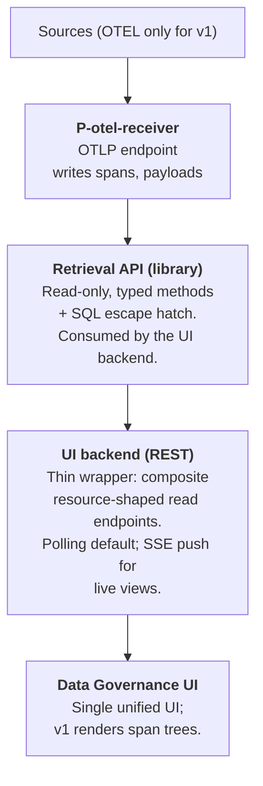

# Data Governance for Rossoctl — Architecture (v2)

## Introduction

The data governance service aims to ensure data is accurate, secure, and used responsibly throughout an organization. It serves to establish visibility and control over how data flows through agents, tools, and systems.

The primary objectives of data governance are:

- **Ensure data quality, transparency and traceability** — Maintain reliable information by tracking and recording how data flows through the system, and provide data lineage and classification so stakeholders understand how and what information moves through the system.
- **Detect data-related vulnerabilities and risks** — Identify and alert on potential vulnerabilities and policy violations (before they impact operations).
- **Enable compliance and remediation** - Provide clear explanations, remediation guidance and enforcement suggestions on policy violations.

## Guiding principles

- Minimal changes to the Rossoctl platform itself.
- Loosely coupled with Rossoctl.
- Build on existing open source (OpenTelemetry / OpenInference for
  events, Postgres for storage).
- Store only raw events that are beneficial for later analytics.

## High-level architecture

**v1 ingestion is one processor.** `P-otel-receiver` owns the OTLP
socket and writes every received span to Postgres verbatim, with
payloads left inline in `attributes`. Nothing is filtered,
classified, normalized into interactions, or correlated against an
entity inventory. The v1 UI renders raw span trees grouped by
`trace_id`, with attribute inspection on click.

## 1. Source and transport

- **Sources (v1): OTEL only.** The ingestion pipeline is
  source-pluggable in design, but only one source is implemented.
- **Transport: OTLP, both gRPC and HTTP/protobuf.** The receiver
  opens both standard ports (4317 gRPC, 4318 HTTP). This matches
  what most OTel collector exporters speak out of the box and avoids
  forcing collector reconfiguration to point at us. Rossoctl's
  `otel-collector` runs a **dedicated `traces/data_governance`
  pipeline** (created by `deploy/patch-rossoctl-collector.sh`) whose
  exporter targets our receiver — a pipeline of our own, not an
  exporter bolted onto a shared or Phoenix pipeline. That is the only
  glue in the platform.
- **OTLP message size pinned at 4 MB.** The receiver accepts the
  OTel collector's default `max_recv_msg_size` (4 MiB on gRPC; the
  matching HTTP body limit). Spans whose serialized batch exceeds
  this are rejected at the transport layer by the sender's collector
  before they reach us — i.e. 4 MB is the de facto per-batch payload
  ceiling for v1. Operators who need larger batches raise the limit
  on both sides; this is documented but not the default. Rationale:
  most existing OTel collector setups are already calibrated to this
  limit, and changing our default would force collector
  reconfiguration upstream — contradicting "no other glue in the
  platform."
- **Deployment topology.** The receiver runs as a Deployment with
  **2 replicas** behind a ClusterIP Service that the upstream OTel
  collector targets. The receiver is stateless — all state lives in
  Postgres — so replicas exist for rolling-update headroom and
  modest throughput, not HA in any production sense. Postgres lives
  in its own StatefulSet in the same namespace; see §3 and ADR-0005.

## 2. Storage

- **Postgres.**
- **No Phoenix dependency.** Ingestion is a parallel OTel sink — now
  literally a separate collector pipeline (§1); raw spans are stored
  by us, not read from Phoenix.

## 3. Spans table and parent linkage

- Single **append-and-finalize** table: `spans`. Rows are inserted
  once and may be updated exactly once on completion (see §3.2 and
  ADR-0004); they are never deleted in v1.
- `spans(trace_id, span_id, parent_id NULL, kind, name,
  service_name NULL, started_at timestamptz, ended_at timestamptz NULL,
  error BOOLEAN NULL, status_message NULL,
  attributes jsonb NOT NULL DEFAULT '{}'::jsonb,
  events jsonb NULL, links jsonb NULL, otlp jsonb NULL,
  scope jsonb NULL, resource_attributes jsonb NULL,
  seq BIGINT, arrival_seq BIGINT NOT NULL,
  observed_at timestamptz,
  PRIMARY KEY (trace_id, span_id))`.
- **PK is composite `(trace_id, span_id)`**, not `span_id` alone.
  OTEL `span_id` is 8 bytes and only locally unique within a trace;
  two spans from different traces could in principle collide on
  `span_id`. Silently dropping a span on PK conflict is the worst
  failure mode, so the PK is composite. Every reference to a span
  carries `trace_id` alongside `span_id`.
- `parent_id` is **nullable and not a foreign key**. It stores
  whatever the OTEL span carried as `parent_span_id`, even if the
  referenced span has not yet arrived (or never arrives).
  Out-of-order arrival is absorbed naturally. The implicit
  `(trace_id, parent_id)` referent is always within the same trace.
- **`P-otel-receiver` has a narrow surface:** append spans verbatim
  (with conditional finalization on completion, §3.2), applying only
  the blocklist filter (§3.1). No parent-chain computation, no
  fix-pass, no cross-trace coordination, no payload extraction or
  hashing — payloads stay inline in `attributes` jsonb. The receiver
  reaches Postgres through the layered `db` module described in
  ADR-0005.
- `seq BIGINT` is allocated monotonically from a sequence at insert
  time, **and re-allocated on update** when a row finalizes
  (ADR-0004). It is the cursor column for stream consumers and is a
  watermark, not a per-row stable identifier.
- `arrival_seq BIGINT NOT NULL` records the row's original `seq` at
  INSERT and is **never updated**. Anything that needs a stable
  per-row handle (recovery checkpoints, idempotence keys, "I observed
  this exact row at this position" semantics) uses `arrival_seq` or
  `(trace_id, span_id)`.
- **Timestamp types.** All three time columns are `timestamptz`
  (microsecond precision; UTC). `started_at` and `ended_at` are
  OTLP-supplied (the instrumented service's clock when the span
  began and ended — *trace-clock*, subject to per-service skew);
  OTLP nanoseconds are truncated to microseconds on ingest, which is
  acceptable for v1 and below the resolution of most platforms'
  monotonic clocks. `observed_at` is set by `P-otel-receiver` at
  insert time (*receiver-clock*); kept for operator/debug queries
  ("did we see anything in the last hour?") and not used for
  user-facing window filtering in v1. All `(time_from, time_to)`
  window queries in §6 filter on `started_at`.

### Attribute typing

OTLP attribute values are mapped to JSON types directly:
string→string, int/double→number, bool→bool, array→array. The
int-vs-double distinction is lost (JSON has only `number`); this is
acceptable for v1 and matches what most OTLP-to-JSON consumers do.

### Span events and links

OTLP span `Event` records (e.g. exceptions) are stored verbatim in
the `events jsonb` column as an array of `{name, time_unix_nano,
attributes}` objects. Span `Link` records are stored similarly in
`links jsonb` as an array of `{trace_id, span_id, attributes}`
objects. Both default to `NULL` when the span has none, which keeps
row size lean for the common case. The receiver always normalizes
empty-or-absent OTLP events/links to SQL `NULL`; it never writes
the JSON literal `[]`. Consumers should treat `events IS NULL` and
`links IS NULL` as the canonical "no events / no links" check.

### `attributes` defaults

`attributes` is `NOT NULL DEFAULT '{}'::jsonb`. The receiver always
writes a (possibly empty) JSON object, never SQL `NULL`. This is
asymmetric with `events`/`links` deliberately: `attributes` is the
catch-all dumping ground for span-level OTLP attributes, and a
consistent shape (always an object) is friendlier to consumers than
the NULL/empty distinction would be.

### Promoted columns

**Promotion rule:** an OTLP top-level field becomes a dedicated
column when the v1 UI reads it directly to render or filter — not
just when the UI filters on it. Everything else stays inside JSONB
columns and can be promoted later without breaking the schema.

The promoted fields and their roles:

- `kind` — OTLP `Span.SpanKind` enum (`INTERNAL`, `SERVER`,
  `CLIENT`, `PRODUCER`, `CONSUMER`). The §8 trace tree picks a
  per-span icon by `kind`; this is what earns its promotion.
- `error` (`BOOLEAN NULL`), `status_message` — derived from OTLP
  span `Status`. Every OTLP span has a `Status.Code`; we map it as:
  `ERROR → true`, `OK → false`, `UNSET → null`. The three OTLP
  states are preserved (no information loss). The UI's error
  semantics in §8 reduce to `error IS TRUE`. `status_message` is
  carried verbatim and is only meaningful when `error IS TRUE`.

`service.name` is also already a column (`service_name`). It is
sourced from the OTLP `Resource.attributes["service.name"]` of the
`ResourceSpans` envelope (Resource-level, **not** span-level). The
column is NULLable; the receiver writes `NULL` when the resource
has no `service.name` attribute. The UI renders NULL as a placeholder
("—" or "(no service)") — a UI choice, not a schema choice.

HTTP attributes, OpenInference / GenAI attributes, and other
span-level attributes stay in `attributes jsonb` for v1. Recognising
richer span semantics (LLM vs tool vs agent) is deliberately out of
scope for v1 and left to a future classifier.

### Resource attributes envelope

Non-`service.name` resource attributes (e.g. `service.namespace`,
`service.version`, `deployment.environment`, K8s attributes) are
stored verbatim in `resource_attributes jsonb NULL` — a sibling
column to `attributes`. The receiver writes the OTLP
`Resource.attributes` map (minus the promoted `service.name`)
verbatim; `NULL` when only `service.name` is present or no resource
attributes at all. Kept in a structurally distinct column so future
processors can filter by resource-level metadata without conflating
it with span-level attributes.

### InstrumentationScope envelope

OTLP `InstrumentationScope` (the `ScopeSpans` envelope: scope name,
version, scope-level attributes) is stored verbatim in
`scope jsonb NULL` as `{name, version, attributes}`. `NULL` when
the OTLP scope is wholly absent (rare). The v1 UI does not read
`scope`, but a future classifier almost certainly will (e.g.
distinguishing OpenInference's OpenAI instrumentation from a generic
HTTP span). Filter via `scope ->> 'name'` for now; promoting
`scope_name` to its own TEXT column is reserved for v1.x if the
filter pattern shows up frequently and the JSONB extraction cost
bites.

### OTLP envelope column

`otlp jsonb NULL` carries the **non-promoted top-level OTLP fields**
that the v1 UI does not read but the receiver should not discard:
`trace_state`, `flags`, `dropped_attributes_count`,
`dropped_events_count`, `dropped_links_count`, and any future
top-level OTLP additions. Stored under their natural OTLP names
(no synthetic prefixes). Defaults to `NULL` when the source span
carried none of these fields, which is the common case.

The `otlp` column is intentionally separate from `attributes` so
that `attributes` remains exactly what OTLP put in `Span.Attributes`
— no mixing of envelope data and span attributes. Future processors
that care about sampling (`flags`), W3C trace context propagation
(`trace_state`), or upstream truncation (`dropped_*_count`) read
this column.

The receiver omits zero-valued / absent envelope fields when writing
`otlp` — e.g. a span with `dropped_attributes_count = 0` does not
get a `{"dropped_attributes_count": 0}` key. If every envelope field
is at its default, `otlp` is `NULL`. This keeps the column lean for
the common case (most spans carry no envelope content beyond
defaults) and is mechanically forced by OTLP's protobuf encoding,
which represents "absent" and "zero" identically for unsigned
integer fields.

### Transactional unit

**One Layer 1 transaction per span** (see ADR-0005 for what "Layer 1"
means). A poison span aborts only its own write; neighbours commit.
Per-span commit overhead is acceptable at v1 volumes; this is
reconsidered if profiling shows commit cost dominating ingest
latency.

### 3.2 Conflict policy: append-and-finalize

`INSERT ... ON CONFLICT (trace_id, span_id)`:

- **DO UPDATE** iff the incoming row has `ended_at IS NOT NULL`
  AND the existing row has `ended_at IS NULL`. The UPDATE clause
  overwrites every mutable column (`kind`, `name`, `attributes`,
  `events`, `links`, `otlp`, `scope`, `resource_attributes`,
  `error`, `status_message`, `ended_at`) and **assigns a fresh
  `seq`** from the same sequence used for inserts. `arrival_seq`,
  `started_at`, `parent_id`, `service_name`, `observed_at` are
  preserved.
- **DO NOTHING** otherwise. Idempotent for OTLP retries that
  re-deliver an already-finalized span. Also drops "second
  partial-flush before completion" cases (neither row has
  `ended_at`, no clear winner) — accepted as a niche.

The mechanism handles OTLP early-flush senders (start-then-end span
emission) without silent data loss while keeping retries idempotent.
**`seq` is a watermark, not a stable identifier** — a row's `seq`
moves forward exactly once during its lifetime, when it finalizes.
Stream consumers cursoring by `seq` see each row up to twice (once
at INSERT, once at completion if it was originally partial) and
must dedupe by `(trace_id, span_id)`, treating the second visit as
the authoritative version. Consumers that need stable per-row
identity use `arrival_seq`. See ADR-0004.

### Stream consumer caveat

Both the §6 retrieval API's `seq`-cursored callers (the recent-traces
UI listing among them — see §6) and any future stream consumer must
account for two sources of cursor non-monotonicity:

- **Insert-allocation gaps.** `seq=N` allocated before `seq=N+1` may
  commit after, briefly making N invisible while N+1 is visible.
- **Update-allocation gaps.** A row's `seq` advancing from M to N
  during finalization is similarly non-atomic — both M and N may be
  briefly invisible to a reader.

v1 has no persistent stream processor, so this is documented and
deferred. v1.x will add a high-water-mark mechanism to `get_spans`
that returns a "safe to resume from" cursor lagging `MAX(seq)` by
the in-flight horizon. The recent-traces UI listing tolerates the
gap because the user's reload (cursor=null) recovers any briefly-
invisible trace.

### Indexes

- `(trace_id, span_id)` — PK, implicit. Serves upward walks
  (resolving a known `parent_id` within the same trace).
- `spans(trace_id, parent_id)` — for downward walks (finding children
  of a given span within a trace) and for the listing-root
  computation's `NOT EXISTS` orphan check (ADR-0001).
- `spans(started_at)` — for the §7 recent-traces window query and any
  `(time_from, time_to)` filter through `get_spans`. Without this,
  every windowed query is a sequential scan.
- `spans(seq)` — for cursor-based pagination over `seq`. Note `seq`
  is mutable (§3.2 / ADR-0004); the index entry is rewritten on
  finalization. At v1 volumes the rewrite cost is negligible.

`arrival_seq` carries no v1 index. Its value to callers is as a
stable identifier in returned `Span` objects, not as a query
predicate; if a future consumer needs to look up rows by
`arrival_seq` directly, an index can be added additively.

### Schema evolution

Schema changes are versioned migrations managed by **Alembic**.
Migration files live alongside the receiver source (e.g.
`data-governance/receiver/migrations/versions/`). The first
migration creates the §3 schema as a baseline; subsequent
migrations are additive (new columns, new indexes) under v1, with
hand-written non-additive migrations possible if needed later.

Alembic is used **without** the SQLAlchemy ORM — migrations are
hand-written SQL via `op.execute(...)` or `.sql` files. The schema
is the source of truth, not Python models. This avoids ORM coupling
while keeping the migration framework's versioning, ordered
application, and history table.

**Invocation.** The receiver ships a single CLI entry point —
`python -m data_governance.receiver migrate` — that runs
`alembic upgrade head` against the configured Postgres and exits.
This same command is invoked everywhere migrations need to run:

- **Kubernetes:** an init container in the receiver pod runs
  `migrate` to completion before the receiver container starts.
  The receiver container itself does not run Alembic; by the time
  it starts, the schema is at head. See ADR-0002.
- **Non-k8s (docker-compose, local development):** the operator
  runs `migrate` manually before starting the receiver, or wires
  it into whatever orchestration they use.

The receiver's `/healthz` (§5.1) therefore reduces to "OTLP open +
Postgres reachable" — it does not gate on migration completion,
because the deployment topology is responsible for migration
ordering.

**Startup schema-version check (defence-in-depth).** On startup the
receiver reads `alembic_version.version_num` from Postgres and
compares it to the head revision compiled into the receiver image.
On mismatch the receiver logs an actionable error and **exits
non-zero**; k8s crash-loops the pod, surfacing the misconfiguration
in `kubectl get pods`. This catches "wrong image deployed against
this DB" / "init container forgotten in some non-k8s deployment"
scenarios that the init container alone would not. See ADR-0002.

**Why a real tool from day one.** Even at v1 scale, schema changes
arrive (new promoted columns, new indexes), and starting with
ad-hoc `CREATE TABLE IF NOT EXISTS` accumulates technical debt
that is awkward to retrofit into a migration history later.
Alembic's per-migration version table, ordered application, and
CI ergonomics are worth the dependency from the start. See
ADR-0002.

## 3.1 Ingest blocklist

The receiver applies a hardcoded blocklist of span-name patterns
before writing. Spans matching any pattern are dropped at the socket
without touching `spans`.

- **Pattern grammar:** exact names *or* `prefix*` glob — nothing
  else. Two-case grammar is easy to scan in PR review and makes the
  blocklist's behavior obvious from reading the entries. Regex /
  attribute predicates are out of scope; if a noisy span needs more
  than name-prefix matching to identify, that's a sign the
  instrumentation should be fixed upstream rather than worked
  around in the blocklist.
- **Form:** a Python module listing the patterns; reviewed by PR.
  Not configurable at runtime.
- **Initial entries:** Kubernetes liveness/readiness probe spans,
  `/metrics` scrape paths, the receiver's own self-spans (if it
  instruments itself).
- **Counts:** dropped spans are tallied in a small
  `blocked_span_counts(pattern, count, last_seen_at)` table for
  observability. No per-span row is kept.
- **OTLP response.** Blocked spans are reported to the OTLP sender
  as **silent successes** — the OTLP request returns OK as if they
  were ingested, and they are not reported in the
  `ExportTracePartialSuccess.rejected_spans` channel.
  Visibility is internal-only via `blocked_span_counts` (this
  section) and `spans_blocked_total{pattern}` (§5.1). Rationale:
  blocking is the receiver's policy, not a sender failure;
  conflating it with the §6 / ADR-0003 `rejected_spans` channel
  would mix "your span was malformed" with "we don't want this
  span." Operators who need cross-team visibility consult
  `spans_blocked_total{pattern}`.
- **Downstream invisibility.** Because blocked spans are never
  written, they are invisible to every `get_spans` query, every
  per-trace aggregate (§6 `counts`), and every listing-root
  computation (§7). A trace whose real root happens to match the
  blocklist will appear in the recent-traces view anchored on its
  earliest non-blocked span (an orphan from the listing's
  perspective) — the **listing root fallback** absorbs this case
  the same way it absorbs lost-in-transit roots.
- **Why hardcoded.** The blocklist is small, slow-changing, and
  load-bearing for ingestion volume. Operator-editable config would
  invite ad-hoc filtering choices that diverge from what the UI and
  any future processors expect.

## 4. Payloads

- **No separate payloads table.** Payloads stay inline in
  `spans.attributes` exactly as the OTLP span carried them. The
  receiver does not extract, normalize, hash, dedup, or truncate
  payload-shaped attributes in v1 — every attribute (payload or
  otherwise) is written verbatim into the `attributes jsonb` blob.
- **No content hashing.** v1 does not compute `content_hash` or any
  cross-span payload identity. Two spans carrying identical prompt
  text store that text twice. Storage cost is accepted in exchange
  for a trivial receiver and a single-table schema; payload dedup
  becomes a v2 design problem if the storage cost ever bites.
- **No size cap, no truncation.** Whatever OTLP delivers is what
  gets stored. Pathological inputs are bounded only by the upstream
  OTLP-collector limits and Postgres row-size limits; this is
  acceptable for a v1 development / demo deployment (see §5).
- **No payload extraction in v1.** Neither the receiver, the
  retrieval library, nor the UI backend interprets payload-shaped
  attribute keys. The v1 UI renders the entire `attributes` blob
  as pretty-printed JSON/YAML in the span detail panel and lets
  the user read it directly. Surfacing prompts, tool inputs, A2A
  messages, etc. as distinct fields requires knowing which keys
  carry which semantics — a future-classifier job.

## 5. Retention

- **v1 keeps everything.** No TTL, no tiering, no aging.
- "Postgres fills up" is treated as a documented operational
  constraint of v1, not a design failure: v1 is a development /
  demo deployment, not a long-running production system. Operators
  monitor disk and recycle the database when needed.
- Retention tiers, time-based TTLs, classification-based tiering,
  and payload-keep-but-span-drop strategies are all v2 design
  problems. They depend on the later increments (classification, an
  entity inventory) to make tier-defining choices.

## 5.1 Receiver runtime observability

The receiver exposes a healthcheck endpoint and a Prometheus metrics
endpoint. This is a v1 operational requirement, not implementation
detail — the contract is pinned here so deployments can rely on it.

- **`GET /healthz`** — returns 200 when the receiver is accepting
  OTLP and can reach Postgres; 503 otherwise.
- **`GET /metrics`** — Prometheus exposition. Required metrics:
  - `spans_received_total{transport}` — counter, OTLP spans
    received per transport (`grpc`/`http`).
  - `spans_blocked_total{pattern}` — counter, spans dropped by
    the §3.1 blocklist, labelled by matched pattern.
  - `spans_inserted_total` — counter, spans successfully written
    via the INSERT path (initial arrivals).
  - `spans_finalized_total` — counter, spans updated via the
    finalization path (§3.2 / ADR-0004) — the start-then-end
    completion case.
  - `spans_duplicate_total` — counter, ON CONFLICT DO NOTHING hits
    (idempotent retries and partial-on-partial drops).
  - `span_insert_duration_seconds` — histogram of per-span write
    latency, covering both INSERT and UPDATE paths.
  - `span_row_bytes` — histogram of the serialized row size on
    write. Lets operators see when payload-heavy spans start
    arriving before the recent-traces UI gets sluggish.
  - `db_errors_total{kind}` — counter, Postgres errors by kind
    (`connection`, `integrity`, `other`). Classification follows
    the SQLSTATE-to-OTLP-response policy in ADR-0003. PK conflicts
    on `(trace_id, span_id)` are **not** errors and are tallied in
    `spans_duplicate_total` instead.

## 6. Retrieval API

- **Read-only at the public surface.** The UI backend and any future
  read-only consumer call only typed methods on the retrieval
  library. v1's only writer is `P-otel-receiver`; future processors
  that read+write reach Postgres through ADR-0005's Layer 1 wrapper
  alongside the typed methods, not through a SQL escape hatch on
  this API.
- **Shape: typed methods only.** The 95%-path method is
  `get_spans(cursor, limit, trace_id, span_id, parent_id, time_from,
  time_to, root_only: bool, order: "asc" | "desc" | None = None)
  -> GetSpansResult`. All filter parameters default to `None`/`False`;
  the method returns spans within the given window, cursored on `seq`.
  When `trace_id` is set the result is restricted to that trace; when
  `span_id` is also set the result is the single matching span. When
  `parent_id` is set, the result is restricted to direct children of
  that parent within the given trace. When `root_only` is set, the
  result is restricted to **listing roots** of traces with activity
  in the window — see below. This single method covers fetching one
  span by id, expanding a trace-tree subtree by parent (UI lazy
  expansion, §8), listing roots (UI recent-traces view, §7), opening
  a single trace by id (UI cold-open / deep-link, §7), and
  recent-spans pagination for future processors. There is no SQL
  escape hatch on this API; future processors that need bespoke SQL
  use ADR-0005's Layer 1 directly.
- **`root_only=True` returns listing roots, not just `parent_id IS
  NULL`.** A **listing root** of a trace is its earliest **real root**
  (`parent_id IS NULL`) if any exists, otherwise its earliest **orphan
  span** — a span whose `parent_id` is set but whose referenced
  `(trace_id, parent_id)` is absent from `spans` at query time. The
  fallback ensures every trace with in-window activity contributes
  exactly one listing root, even if its OTLP root never arrived
  (dropped by the blocklist, lost in transit, not yet ingested). The
  caller distinguishes the two cases by inspecting the returned span's
  `parent_id` (null = real root; non-null = orphan acting as listing
  root). Orphan-ness is computed at query time; see ADR-0001.
- **`root_only=True` with `trace_id=T`** returns exactly that trace's
  listing root (or empty if the trace has no spans at all). The
  `(time_from, time_to)` window is **ignored** in this case — the
  caller named the trace by id, the API always answers. Use case:
  UI cold-open / deep-link to `/ui/traces/T` (§7). Inherits eventual-
  consistency from ADR-0001: a cold open during a listing-root flip
  may see the orphan or the real root depending on timing; the UI
  re-resolves on next interaction.
- **Parameter compatibility.** `parent_id` requires `trace_id`
  (OTEL `span_id` is only locally unique within a trace, so a bare
  `parent_id` is ambiguous). `root_only=True` is incompatible with
  `parent_id` and with `span_id`; it **is** compatible with
  `trace_id` (single-trace listing-root case, above). Violations
  raise.
- **`in_time_window` field on returned spans.** Each `Span` carries
  `in_time_window: bool`, true iff its `started_at` falls within the
  request's `(time_from, time_to)`. False on out-of-window spans
  returned because they are listing roots of in-window traces (the
  only path by which the method returns out-of-window spans in v1).
  Defaults to `True` when the caller supplied no window. The UI uses
  it to grey out out-of-window roots in the recent-traces listing.
  Window basis is trace-clock (`started_at`), so clock skew across
  services is reflected in the result — OTEL itself doesn't solve
  this and v1 doesn't paper over it.
- **Receiver stays semantically unaware.** The receiver and the retrieval
  library do not interpret span semantics (trace boundaries beyond
  `trace_id` grouping, payload-shaped attribute keys). The retrieval
  library does compute listing-root identity (real root vs orphan
  fallback) on demand for `root_only=True` — this is the one piece of
  span-relationship logic in v1, deliberately localized to the
  retrieval API and documented above.
- **Cursor encoding is path-shaped.** The REST `cursor` parameter is
  always a `seq BIGINT` from a returned `Span`. Postgres `ctid` and
  `xmin` were considered and rejected: `ctid` is unstable across
  `VACUUM FULL` / `CLUSTER` / `pg_repack` and is not even monotonic
  on insert; `xmin` is not unique per row and is rewritten by VACUUM
  freeze. `seq` from a sequence-allocated BIGINT is the standard,
  stable-enough, indexable choice. Note `seq` is a watermark, not
  a per-row stable identifier (§3.2 / ADR-0004): a row's `seq`
  advances exactly once on finalization. Stream consumers cursoring
  by `seq` see each row up to twice and dedupe by
  `(trace_id, span_id)`; the second visit is the authoritative
  version. **How the server translates the caller's `seq` into a
  predicate is path-dependent (see Sort order below).**
- **`seq` orders by arrival at the receiver, not by `started_at`.**
  A child span may have lower `seq` than its parent if the parent
  arrives late; both are still delivered. Processors that need
  causal order do their own buffering — the retrieval API does not
  reorder.
- **Sort order varies by query shape (Path 3).** The REST cursor is
  always `seq`; the **sort and internal cursor predicate** depend on
  what the caller asked for:
  - `root_only=True` → sort by listing-root `started_at desc, span_id
    asc` (newest traces first). The server resolves the caller's `seq`
    to the span's `(started_at, span_id)` and applies a composite
    keyset predicate `(started_at < cursor_started_at) OR
    (started_at = cursor_started_at AND span_id > cursor_span_id)`.
    Sort and cursor axes now agree, so the "skips impossible" property
    holds unconditionally (issue #30 / ADR-0001). Duplicates remain
    possible when a trace's listing root flips between pages as late
    spans arrive; the UI dedupes by `trace_id`.
  - `parent_id` set (subtree expansion) → sort by `seq asc`. The
    sort axis matches the cursor axis, so neither duplicates nor
    skips are possible on this path. (`started_at asc` was the
    original spec, but it would create the same cursor/sort-axis
    mismatch — a child with low `seq` and late `started_at` can be
    silently skipped once the cursor advances past `max(seq)` of a
    page.)
  - Otherwise (bare processor stream / `trace_id` only / `span_id`
    only) → sort by `seq asc` (catch-up order). Callers that want
    descending pass `order="desc"`. Sort and cursor agree; no skips.
- **Concurrent-insert and update-allocation gaps (deferred to v1.x).**
  See §3 stream-consumer caveat for the failure mode. The recent-
  traces UI listing in §7 is itself a `seq`-cursored consumer: a
  trace whose listing root sits in the gap may be briefly invisible
  to a given paginated session. User reload (cursor=null) recovers
  it. v1.x will add a high-water-mark mechanism to `get_spans` when
  the first persistent stream consumer lands.
- **Time semantics:**
  - `(time_from, time_to)` filters on `started_at` (trace-clock,
    OTLP-supplied — see §3). `observed_at` is not exposed in
    user-facing windowing in v1. Library accepts tz-aware
    `datetime` or `int` (nanoseconds since epoch); REST encoding
    is ISO-8601 with required `Z` or explicit offset (naive
    datetimes are rejected).
  - `time_from = NULL` → "from the beginning of retained data."
  - `time_to = NULL` → "up until now."
  - Both NULL = no window filter, the whole `spans` table is in
    scope. Symmetric with `time_to = NULL`; relied on by the
    processor stream use case (cursor + limit, no window).
  - Snapshot queries = `time_from == time_to` or degenerate range.
  - **Late arrivals.** A span arriving at the receiver well after
    its `started_at` (network blip, OTLP retry, queued batch) is
    visible to window queries covering its `started_at`, not its
    arrival time. The processor stream sees it at its `seq` (high,
    because it arrived late); a UI window query over its
    `started_at` sees it at its source-clock position. Both correct
    for their use cases.
- **Default `limit` is 50; max is 500 (hard cap).** The default
  bounds the blast radius of a bare `get_spans(cursor=None)` call
  under v1's keep-everything retention (§5). The 500 cap is enforced
  in the library and inherited by the REST surface (§7); callers
  passing `limit > 500` raise. Bulk callers (analytics, backfills)
  use ADR-0005's Layer 1 directly with their own cursor logic;
  `get_spans` is shaped for interactive use.
- **Per-trace counts on `root_only=True`.** When `root_only=True`,
  the method also returns a per-trace counts map keyed by
  `trace_id`: `{trace_id: {total: int, in_window: int,
  error_count: int}}`. `total` is the trace's full span count in
  `spans`; `in_window` is the count of spans whose `started_at`
  falls within `(time_from, time_to)` (excluding the listing root
  when the listing root is itself out-of-window); `error_count` is
  the number of spans in the trace with `error IS TRUE` at query
  time. The counts ride alongside the `list[Span]` return value —
  concretely, `get_spans` returns a small wrapper:
  `GetSpansResult(spans: list[Span], counts: dict[str, TraceCounts]
  | None)`. `counts` is `None` when `root_only=False`. The shape
  intentionally avoids decorating `Span` with optional listing-root
  fields, keeping `Span` as a plain OTLP span row. With the limit
  hard-capped at 500, the per-row count cost (one `COUNT(*) FILTER`
  / `EXISTS` / `COUNT(*)` per returned row) is bounded.
- **Versioning per method, not per API.** Evolve one method at a time.

## 7. UI backend

- **Namespaced REST surface.** JSON resources live under `/api/`, HTML
  pages and JS assets under `/ui/`, bare `/` 302-redirects to `/ui/`, and
  `/healthz` stays un-prefixed at the root for infra probes (ADR-0017).
- **Trace/span resource tree.** The span reads are a resource tree, not
  the single `GET /spans` pass-through the tracer bullet shipped (retired
  by ADR-0018):
  - `GET /api/traces` — recent-traces feed → `{"traces": [TraceListingEntry]}`
    (was `root_only=true&time_from&time_to`).
  - `GET /api/traces/{tid}` — one **TraceListingEntry** (cold-open seed;
    was `root_only=true&trace_id`).
  - `GET /api/traces/{tid}/spans` — the whole trace, flat, paginated
    (`{"spans": [...], "counts": null}`; ships without a current UI caller).
  - `GET /api/traces/{tid}/spans/{sid}` — one full-row `Span` (was
    `trace_id&span_id`; ADR-0006's one-shape contract).
  - `GET /api/traces/{tid}/spans/{sid}/children` — direct children,
    keyset-paginated (was `trace_id&parent_id&cursor&limit`).
  A **TraceListingEntry** is `{trace_id, listing_root, counts, in_time_window}`
  — the listing-root `Span` nested, per-trace **Trace counts** inline —
  and is the identical shape for the collection element and the singular.
  The execution-flow resources (`.../interactions`, `.../entities`, their
  `/spans` sub-resources) and `GET /api/payloads/{hash}` share the `/api/`
  namespace. Every handler calls the library `get_spans` (§6) — its
  `root_only` / `parent_id` / `cursor` parameters and compatibility raises
  are unchanged; only the HTTP surface was reshaped.
- **No expansion parameters in v1.** The `attributes` blob (with
  inline payloads) is always returned. If response size becomes a
  problem in practice, the typical remediation is a per-key opt-out
  query parameter, but v1 doesn't speculate. The UI's listing page
  size of 20 (below) does most of the heavy lifting on listing-page
  bytes-per-page.
- **Live updates: polling only.** v1 ships no push channel. SSE /
  websocket live-tail is reserved for v1.x and depends on the §6
  high-water-mark mechanism — a stream consumer can't be correct
  under the §3 / §6 cursor-allocation gap without it.

### Recent-traces view (UI flow on `GET /api/traces`)

The recent-traces view is rendered from
`GET /api/traces?time_from=...&time_to=...&cursor=...&limit=20`, which
returns `{"traces": [TraceListingEntry]}`. Each entry's `listing_root` is
the **listing root** of a trace with in-window activity, applying the
**listing root fallback** (real root if any, else earliest orphan) — see §6
and ADR-0001. The entry's `counts` carries `{total, in_window, error_count}`
for the row's display, and `in_time_window` flags whether the anchor is in
window. The UI's default page size is **20** rows.

The UI (flattening each entry to a row of the `listing_root` span fields plus
the entry's `trace_id` / `in_time_window`, with `counts` stashed by
`trace_id`):

- Inspects `listing_root.parent_id` to label the row ("real root" vs
  "missing parent" badge).
- Uses `in_time_window` to grey out roots whose `started_at` falls
  outside the requested window.
- Displays `in_window / total` from the per-trace counts so the
  user sees burst activity within the window against the trace's
  full size.
- Renders an error badge with the count when
  `counts.error_count > 0` (§8).
- **Dedupes by `trace_id` client-side.** A trace's listing root may
  flip from an orphan to a real root as late spans arrive (ADR-0001),
  or its `seq` may advance via finalization (§3.2 / ADR-0004). Two
  pages of results may therefore both contain a row for the same
  `trace_id` with different anchor spans; the UI keeps the most
  recent (highest-`seq`) anchor and discards earlier ones. This is
  the price of cursor-by-`seq` simplicity over a server-side frozen
  snapshot.

### Trace tree view (UI flow on the `/api/traces` tree)

Opening a trace from a listing row: the listing-root `Span` is
already in hand (cached in sessionStorage from the recent-traces
response). The UI uses it as the tree's root anchor with no extra fetch.

Cold-open / deep-link to a single trace (e.g. user pastes a
`/ui/traces/T` URL): the UI fetches the trace's **TraceListingEntry** via
`GET /api/traces/T` and reads `.listing_root` as the anchor. Returns the
entry (listing root + `counts`); window parameters do not apply to the
singular (§6). A 404 renders the "Trace not found." empty state.

Subtree expansion (every click that drills into a node): the UI
fetches direct children via
`GET /api/traces/T/spans/P/children?cursor=...`. Pagination is by
`seq`; a single parent with more than `limit` children paginates
across multiple calls. Wide-fan-out parents (loops, batch jobs) are
the realistic case where this matters.

Single-span re-fetch (Refresh button, reveal-in-tree): the UI fetches
`GET /api/traces/T/spans/S`, which returns the full-row `Span` directly.

### Eventual consistency

The listing is **eventually consistent**. A trace's listing root may
flip from "earliest orphan" to "real root" as late spans arrive
(ADR-0001), and its row may reorder in the listing accordingly —
the listing is sorted by listing-root `started_at` descending (§6
Path 3), and a real root and an orphan generally have different
`started_at`. The cursor is `seq` (§6); the "skips impossible,
duplicates possible" property from ADR-0001 holds, and the UI
dedupes by `trace_id` as it accumulates pages.

No `traces` summary table is maintained — the listing query runs
over `spans` directly via `get_spans(root_only=True, ...)`. This is
acceptable at v1 volumes; if profiling shows it dominating UI
latency at production scale, a refreshable materialized view is the
v1.x remediation, additive to schema and receiver.

### Authentication and exposure (v1)

The OTLP receive socket and the UI backend are **unauthenticated**
in v1. Both are intended to run cluster-internal, with a Kubernetes
NetworkPolicy restricting access to the Rossoctl namespace.
Production exposure (external auth, RBAC, mTLS) is a v2 concern;
running v1 outside an isolated cluster is unsupported.

## 8. UI

The v1 UI is a single page with two views:

- **Recent traces** — paginated list rendered from
  `GET /api/traces?time_from=...&time_to=...&cursor=...&limit=20`
  (see §7). Each row shows the listing root's `service_name`,
  `name`, `started_at`, the trace's `in_window / total` from the
  entry's per-trace counts, an **error badge** showing
  `counts.error_count` when `> 0`, and a "missing parent"
  badge when the listing root is an orphan (its `parent_id` is
  non-null). Roots whose `started_at` is outside the requested
  window (`in_time_window = false`) are rendered greyed out so the
  user can see the trace exists without it claiming foreground
  attention. A filter toggle lets the user hide traces whose listing
  root is a missing-parent orphan. Clicking a row opens the trace
  tree. The UI dedupes rows by `trace_id` as it accumulates pages —
  see §7.
- **Trace tree** — spans of a single trace grouped by `trace_id` and
  linked by `parent_id`. Each span renders with a per-`kind` icon
  (one of `INTERNAL`, `SERVER`, `CLIENT`, `PRODUCER`, `CONSUMER`),
  giving the user a fast visual cue for the span's role at the
  network boundary. Two error badges, both UI-side, derived from
  the `error` column (`true ↔ ERROR`, `false ↔ OK`,
  `null ↔ UNSET`):
  - **Error badge** on each span with `error IS TRUE` — the span
    where the failure happened. `status_message` is shown alongside.
  - **Descendant-error badge** (visually quieter, distinct from the
    error badge) on every ancestor of an `error IS TRUE` span —
    "something inside this span failed, drill in to find it."
    Computed client-side as the UI walks the loaded ancestor chain;
    appears progressively as the user expands subtrees. **v1
    limitation:** the trace tree is lazy (§7), so an `error IS TRUE`
    span inside a *collapsed* subtree does not propagate a badge to
    its loaded ancestors — the user has no signal until they expand
    the failing branch. The listing row's `error_count` badge (§7)
    tells the user the trace has *some* error; finding it currently
    requires expansion. A v1.x per-trace error summary (returning
    `{span_id: has_descendant_error}` for the whole trace, fetched
    on trace-open) is reserved for if this bites.
  No semantic coloring beyond these two badges in v1. The receiver
  and retrieval API do not interpret error semantics — they only
  project OTLP `Status.Code` into the `error` boolean. Richer error
  inference (HTTP status, exception events, domain attributes) is a
  future-classifier job.
  Clicking a span opens a detail panel showing its `attributes`,
  `events`, and `links` rendered as pretty-printed JSON/YAML — no
  per-key semantic surfacing in v1.

No topology view, no sequence diagrams, no classification overlays —
those return when the corresponding processors are designed in a
later increment.

## Open questions

- **Inline-payload storage cost.** v1 stores payloads verbatim
  inside `attributes` with no dedup, hashing, or truncation (§4).
  This is fine for development / demo volumes but will not scale:
  duplicated prompts, large tool outputs, and pathological inputs
  all land in the row unmodified. Re-introducing a separate
  payloads table (with content-addressed storage and a size cap)
  is the obvious v2 move once observed row-size distribution
  justifies the complexity.
