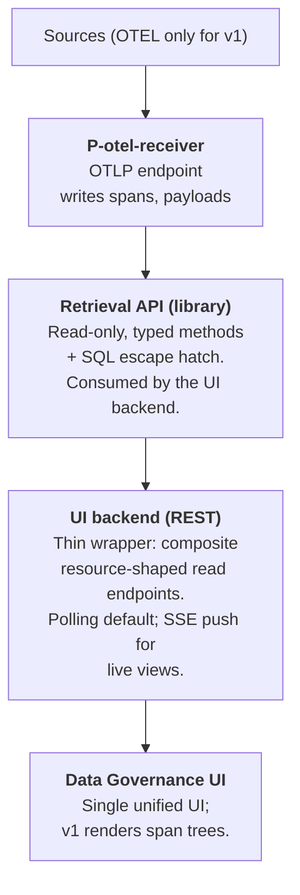

# Data Governance for Kagenti — Architecture (v2)

## Introduction

The data governance service aims to ensure data is accurate, secure, and used responsibly throughout an organization. It serves to establish visibility and control over how data flows through agents, tools, and systems.

The primary objectives of data governance are:

- **Ensure data quality, transparency and traceability** — Maintain reliable information by tracking and recording how data flows through the system, and provide data lineage and classification so stakeholders understand how and what information moves through the system.
- **Detect data-related vulnerabilities and risks** — Identify and alert on potential vulnerabilities and policy violations (before they impact operations).
- **Enable compliance and remediation** - Provide clear explanations, remediation guidance and enforcement suggestions on policy violations.

## Guiding principles

- Minimal changes to the Kagenti platform itself.
- Loosely coupled with Kagenti.
- Build on existing open source (OpenTelemetry / OpenInference for
  events, Postgres for storage).
- Store only raw events that are beneficial for later analytics.

## High-level architecture

**v1 ingestion is one processor.** `P-otel-receiver` owns the OTLP
socket and writes every received span to Postgres verbatim, with
payloads left inline in `attributes`. Nothing is filtered,
classified, normalized into interactions, or correlated against an
entity inventory. The v1 UI renders raw span trees grouped by
`trace_id`, with attribute inspection on click.

## 1. Source and transport

- **Sources (v1): OTEL only.** The ingestion pipeline is
  source-pluggable in design, but only one source is implemented.
- **Transport: OTLP, both gRPC and HTTP/protobuf.** The receiver
  opens both standard ports (4317 gRPC, 4318 HTTP). This matches
  what most OTel collector exporters speak out of the box and avoids
  forcing collector reconfiguration to point at us. Kagenti's OTEL
  collector adds an exporter targeting one of the endpoints; no
  other glue in the platform.

## 2. Storage

- **Postgres.**
- **No Phoenix dependency.** Ingestion is a parallel OTel sink; raw
  spans are stored by us, not read from Phoenix.

## 3. Spans table and parent linkage

- Single append-only table: `spans`.
- `spans(trace_id, span_id, parent_id NULL, kind, name, service_name,
  started_at, ended_at, error BOOLEAN NULL, status_message NULL,
  attributes jsonb, events jsonb, links jsonb, otlp jsonb NULL,
  seq BIGINT, observed_at,
  PRIMARY KEY (trace_id, span_id))`.
- **PK is composite `(trace_id, span_id)`**, not `span_id` alone.
  OTEL `span_id` is 8 bytes and only locally unique within a trace;
  two spans from different traces could in principle collide on
  `span_id`. Silently dropping a span on PK conflict is the worst
  failure mode, so the PK is composite. Every reference to a span
  carries `trace_id` alongside `span_id`.
- `parent_id` is **nullable and not a foreign key**. It stores
  whatever the OTEL span carried as `parent_span_id`, even if the
  referenced span has not yet arrived (or never arrives).
  Out-of-order arrival is absorbed naturally. The implicit
  `(trace_id, parent_id)` referent is always within the same trace.
- **`P-otel-receiver` is trivial:** append spans verbatim, applying
  only the blocklist filter (§3.1). No parent-chain computation, no
  fix-pass, no cross-trace coordination, no payload extraction or
  hashing — payloads stay inline in `attributes` jsonb.
- `seq BIGINT` is assigned monotonically on ingest for cursor-based
  retrieval over append-only spans.
- **Timestamp source matters.** `started_at` and `ended_at` are
  OTLP-supplied (the instrumented service's clock when the span
  began and ended — *trace-clock*, subject to per-service skew).
  `observed_at` is set by `P-otel-receiver` at insert time
  (*receiver-clock*); kept for operator/debug queries ("did we see
  anything in the last hour?") and not used for user-facing window
  filtering in v1. All `(time_from, time_to)` window queries in §6
  filter on `started_at`.

### Attribute typing

OTLP attribute values are mapped to JSON types directly:
string→string, int/double→number, bool→bool, array→array. The
int-vs-double distinction is lost (JSON has only `number`); this is
acceptable for v1 and matches what most OTLP-to-JSON consumers do.

### Span events and links

OTLP span `Event` records (e.g. exceptions) are stored verbatim in
the `events jsonb` column as an array of `{name, time_unix_nano,
attributes}` objects. Span `Link` records are stored similarly in
`links jsonb` as an array of `{trace_id, span_id, attributes}`
objects. Both default to `NULL` when the span has none, which keeps
row size lean for the common case.

### Promoted columns

**Promotion rule:** an OTLP top-level field becomes a dedicated
column when the v1 UI reads it directly to render or filter — not
just when the UI filters on it. Everything else stays inside JSONB
columns and can be promoted later without breaking the schema.

The promoted fields and their roles:

- `kind` — OTLP `Span.SpanKind` enum (`INTERNAL`, `SERVER`,
  `CLIENT`, `PRODUCER`, `CONSUMER`). The §8 trace tree picks a
  per-span icon by `kind`; this is what earns its promotion.
- `error` (`BOOLEAN NULL`), `status_message` — derived from OTLP
  span `Status`. Every OTLP span has a `Status.Code`; we map it as:
  `ERROR → true`, `OK → false`, `UNSET → null`. The three OTLP
  states are preserved (no information loss). The UI's error
  semantics in §8 reduce to `error IS TRUE`. `status_message` is
  carried verbatim and is only meaningful when `error IS TRUE`.

`service.name` is also already a column (`service_name`).
`service.namespace`, HTTP attributes, OpenInference / GenAI
attributes, and everything else stay in `attributes jsonb` for v1.
Recognising richer span semantics (LLM vs tool vs agent) is
deliberately out of scope for v1 and left to a future classifier.

### OTLP envelope column

`otlp jsonb NULL` carries the **non-promoted top-level OTLP fields**
that the v1 UI does not read but the receiver should not discard:
`trace_state`, `flags`, `dropped_attributes_count`,
`dropped_events_count`, `dropped_links_count`, and any future
top-level OTLP additions. Stored under their natural OTLP names
(no synthetic prefixes). Defaults to `NULL` when the source span
carried none of these fields, which is the common case.

The `otlp` column is intentionally separate from `attributes` so
that `attributes` remains exactly what OTLP put in `Span.Attributes`
— no mixing of envelope data and span attributes. Future processors
that care about sampling (`flags`), W3C trace context propagation
(`trace_state`), or upstream truncation (`dropped_*_count`) read
this column.

### Transactional unit

**One transaction per span.** A poison span aborts only its own
write; neighbours commit. Per-span commit overhead is acceptable at
v1 volumes; this is reconsidered if profiling shows commit cost
dominating ingest latency.

**Duplicate handling:** `INSERT ... ON CONFLICT (trace_id, span_id)
DO NOTHING`. First writer wins; subsequent arrivals with the same
`(trace_id, span_id)` are silently dropped. OTLP retries (which can
re-deliver the same span after a network blip) are therefore
idempotent. No update path in v1.

### Indexes

- `(trace_id, span_id)` — PK, implicit. Serves upward walks
  (resolving a known `parent_id` within the same trace).
- `spans(trace_id, parent_id)` — for downward walks (finding children
  of a given span within a trace).
- `spans(started_at)` — for the §7 recent-traces window query and any
  `(time_from, time_to)` filter through `get_spans`. Without this,
  every windowed query is a sequential scan.

### Schema evolution

Schema changes are versioned migrations managed by **Alembic**.
Migration files live alongside the receiver source (e.g.
`data-governance/receiver/migrations/versions/`). The first
migration creates the §3 schema as a baseline; subsequent
migrations are additive (new columns, new indexes) under v1, with
hand-written non-additive migrations possible if needed later.

Alembic is used **without** the SQLAlchemy ORM — migrations are
hand-written SQL via `op.execute(...)` or `.sql` files. The schema
is the source of truth, not Python models. This avoids ORM coupling
while keeping the migration framework's versioning, ordered
application, and history table.

**Invocation.** The receiver ships a single CLI entry point —
`python -m data_governance.receiver migrate` — that runs
`alembic upgrade head` against the configured Postgres and exits.
This same command is invoked everywhere migrations need to run:

- **Kubernetes:** an init container in the receiver pod runs
  `migrate` to completion before the receiver container starts.
  The receiver container itself does not run Alembic; by the time
  it starts, the schema is at head. See ADR-0002.
- **Non-k8s (docker-compose, local development):** the operator
  runs `migrate` manually before starting the receiver, or wires
  it into whatever orchestration they use.

The receiver's `/healthz` (§5.1) therefore reduces to "OTLP open +
Postgres reachable" — it does not gate on migration completion,
because the deployment topology is responsible for migration
ordering.

**Why a real tool from day one.** Even at v1 scale, schema changes
arrive (new promoted columns, new indexes), and starting with
ad-hoc `CREATE TABLE IF NOT EXISTS` accumulates technical debt
that is awkward to retrofit into a migration history later.
Alembic's per-migration version table, ordered application, and
CI ergonomics are worth the dependency from the start. See
ADR-0002.

## 3.1 Ingest blocklist

The receiver applies a hardcoded blocklist of span-name patterns
before writing. Spans matching any pattern are dropped at the socket
without touching `spans`.

- **Pattern grammar:** exact names *or* `prefix*` glob — nothing
  else. Two-case grammar is easy to scan in PR review and makes the
  blocklist's behavior obvious from reading the entries. Regex /
  attribute predicates are out of scope; if a noisy span needs more
  than name-prefix matching to identify, that's a sign the
  instrumentation should be fixed upstream rather than worked
  around in the blocklist.
- **Form:** a Python module listing the patterns; reviewed by PR.
  Not configurable at runtime.
- **Initial entries:** Kubernetes liveness/readiness probe spans,
  `/metrics` scrape paths, the receiver's own self-spans (if it
  instruments itself).
- **Counts:** dropped spans are tallied in a small
  `blocked_span_counts(pattern, count, last_seen_at)` table for
  observability. No per-span row is kept.
- **Downstream invisibility.** Because blocked spans are never
  written, they are invisible to every `get_spans` query, every
  per-trace aggregate (§6 `counts`), and every listing-root
  computation (§7). A trace whose real root happens to match the
  blocklist will appear in the recent-traces view anchored on its
  earliest non-blocked span (an orphan from the listing's
  perspective) — the **listing root fallback** absorbs this case
  the same way it absorbs lost-in-transit roots.
- **Why hardcoded.** The blocklist is small, slow-changing, and
  load-bearing for ingestion volume. Operator-editable config would
  invite ad-hoc filtering choices that diverge from what the UI and
  any future processors expect.

## 4. Payloads

- **No separate payloads table.** Payloads stay inline in
  `spans.attributes` exactly as the OTLP span carried them. The
  receiver does not extract, normalize, hash, dedup, or truncate
  payload-shaped attributes in v1 — every attribute (payload or
  otherwise) is written verbatim into the `attributes jsonb` blob.
- **No content hashing.** v1 does not compute `content_hash` or any
  cross-span payload identity. Two spans carrying identical prompt
  text store that text twice. Storage cost is accepted in exchange
  for a trivial receiver and a single-table schema; payload dedup
  becomes a v2 design problem if the storage cost ever bites.
- **No size cap, no truncation.** Whatever OTLP delivers is what
  gets stored. Pathological inputs are bounded only by the upstream
  OTLP-collector limits and Postgres row-size limits; this is
  acceptable for a v1 development / demo deployment (see §5).
- **No payload extraction in v1.** Neither the receiver, the
  retrieval library, nor the UI backend interprets payload-shaped
  attribute keys. The v1 UI renders the entire `attributes` blob
  as pretty-printed JSON/YAML in the span detail panel and lets
  the user read it directly. Surfacing prompts, tool inputs, A2A
  messages, etc. as distinct fields requires knowing which keys
  carry which semantics — a future-classifier job.

## 5. Retention

- **v1 keeps everything.** No TTL, no tiering, no aging.
- "Postgres fills up" is treated as a documented operational
  constraint of v1, not a design failure: v1 is a development /
  demo deployment, not a long-running production system. Operators
  monitor disk and recycle the database when needed.
- Retention tiers, time-based TTLs, classification-based tiering,
  and payload-keep-but-span-drop strategies are all v2 design
  problems. They depend on the later increments (classification, an
  entity inventory) to make tier-defining choices.

## 5.1 Receiver runtime observability

The receiver exposes a healthcheck endpoint and a Prometheus metrics
endpoint. This is a v1 operational requirement, not implementation
detail — the contract is pinned here so deployments can rely on it.

- **`GET /healthz`** — returns 200 when the receiver is accepting
  OTLP and can reach Postgres; 503 otherwise.
- **`GET /metrics`** — Prometheus exposition. Required metrics:
  - `spans_received_total{transport}` — counter, OTLP spans
    received per transport (`grpc`/`http`).
  - `spans_blocked_total{pattern}` — counter, spans dropped by
    the §3.1 blocklist, labelled by matched pattern.
  - `spans_inserted_total` — counter, spans successfully written.
  - `spans_duplicate_total` — counter, ON CONFLICT DO NOTHING hits.
  - `span_insert_duration_seconds` — histogram of per-span insert
    latency.
  - `db_errors_total{kind}` — counter, Postgres errors by kind
    (connection, integrity, other).

## 6. Retrieval API

- **Read-only.** v1 has no writers other than `P-otel-receiver`.
- **Shape: typed methods + SQL escape hatch.** The 95%-path method is
  `get_spans(cursor, limit, trace_id, span_id, parent_id, time_from,
  time_to, root_only: bool) -> list[Span]`. All filter parameters
  default to `None`/`False`; the method returns spans within the given
  window, cursored on `seq`. When `trace_id` is set the result is
  restricted to that trace; when `span_id` is also set the result is
  the single matching span. When `parent_id` is set, the result is
  restricted to direct children of that parent within the given trace.
  When `root_only` is set, the result is restricted to **listing
  roots** of traces with activity in the window — see below. This
  single method covers recent-spans pagination (processor stream),
  fetching one trace's spans (UI trace tree), fetching one span by id,
  expanding a subtree by parent (UI lazy expansion), and listing roots
  (UI recent-traces listing). Escape hatch for genuinely ad-hoc needs;
  promote to typed method when used twice.
- **`root_only=True` returns listing roots, not just `parent_id IS
  NULL`.** A **listing root** of a trace is its earliest **real root**
  (`parent_id IS NULL`) if any exists, otherwise its earliest **orphan
  span** — a span whose `parent_id` is set but whose referenced
  `(trace_id, parent_id)` is absent from `spans` at query time. The
  fallback ensures every trace with in-window activity contributes
  exactly one listing root, even if its OTLP root never arrived
  (dropped by the blocklist, lost in transit, not yet ingested). The
  caller distinguishes the two cases by inspecting the returned span's
  `parent_id` (null = real root; non-null = orphan acting as listing
  root). Orphan-ness is computed at query time; see ADR-0001.
- **Parameter compatibility.** `parent_id` requires `trace_id`
  (OTEL `span_id` is only locally unique within a trace, so a bare
  `parent_id` is ambiguous). `root_only=True` is incompatible with
  `parent_id` and with `span_id`. Violations raise.
- **`in_time_window` field on returned spans.** Each `Span` carries
  `in_time_window: bool`, true iff its `started_at` falls within the
  request's `(time_from, time_to)`. False on out-of-window spans
  returned because they are listing roots of in-window traces (the
  only path by which the method returns out-of-window spans in v1).
  Defaults to `True` when the caller supplied no window. The UI uses
  it to grey out out-of-window roots in the recent-traces listing.
  Window basis is trace-clock (`started_at`), so clock skew across
  services is reflected in the result — OTEL itself doesn't solve
  this and v1 doesn't paper over it.
- **Receiver stays semantically unaware.** The receiver and the retrieval
  library do not interpret span semantics (trace boundaries beyond
  `trace_id` grouping, payload-shaped attribute keys). The retrieval
  library does compute listing-root identity (real root vs orphan
  fallback) on demand for `root_only=True` — this is the one piece of
  span-relationship logic in v1, deliberately localized to the
  retrieval API and documented above.
- **SQL escape hatch is library-only.** It is reachable from Python
  callers (the UI backend, future processors, ad-hoc analytics in a
  REPL or notebook) but is not exposed through the UI backend's
  REST surface. The UI backend uses only typed methods.
- **Cursors are `seq`.** Always the `seq BIGINT` column on `spans`,
  no other column and no opaque token. Postgres `ctid` and `xmin`
  were considered and rejected: `ctid` is unstable across `VACUUM
  FULL` / `CLUSTER` / `pg_repack` and is not even monotonic on
  insert; `xmin` is not unique per row and is rewritten by VACUUM
  freeze. `seq` from a `BIGSERIAL`/identity sequence is the
  standard, stable, indexable choice and what every method's cursor
  refers to.
- **`seq` orders by arrival at the receiver, not by `started_at`.**
  A child span may have lower `seq` than its parent if the parent
  arrives late; both are still delivered. Processors that need
  causal order do their own buffering — the retrieval API does not
  reorder.
- **Concurrent-insert gaps (deferred to v1.x).** A `BIGSERIAL` `seq`
  is allocated at insert time, not commit time. Two concurrent ingest
  transactions can allocate `seq=N` and `seq=N+1` and commit in the
  reverse order, briefly making row N invisible while N+1 is visible.
  A processor that advances its cursor past N+1 before N commits would
  miss N. v1's intra-receiver "one transaction per span" (§3) keeps
  the window narrow but does not eliminate it. v1 has no persistent
  stream consumer, so this is documented and deferred; v1.x will add a
  high-water-mark mechanism to `get_spans` (return a "safe to resume
  from" cursor that lags `MAX(seq)` by the in-flight horizon) when the
  first real processor lands.
- **Time semantics:**
  - `(time_from, time_to)` filters on `started_at` (trace-clock,
    OTLP-supplied — see §3). `observed_at` is not exposed in
    user-facing windowing in v1.
  - `time_from = NULL` → "from the beginning of retained data."
  - `time_to = NULL` → "up until now."
  - Both NULL = no window filter, the whole `spans` table is in
    scope. Symmetric with `time_to = NULL`; relied on by the
    processor stream use case (cursor + limit, no window).
  - Snapshot queries = `time_from == time_to` or degenerate range.
  - **Late arrivals.** A span arriving at the receiver well after
    its `started_at` (network blip, OTLP retry, queued batch) is
    visible to window queries covering its `started_at`, not its
    arrival time. The processor stream sees it at its `seq` (high,
    because it arrived late); a UI window query over its
    `started_at` sees it at its source-clock position. Both correct
    for their use cases.
- **Default `limit` is 50.** Matches the recent-traces page size
  (§7) and bounds the blast radius of a bare
  `get_spans(cursor=None)` call returning the oldest spans in the
  database under v1's keep-everything retention (§5).
- **Per-trace counts on `root_only=True`.** When `root_only=True`,
  the method also returns a per-trace counts map keyed by
  `trace_id`: `{trace_id: {total: int, in_window: int}}`. `total`
  is the trace's full span count in `spans`; `in_window` is the
  count of spans whose `started_at` falls within `(time_from,
  time_to)` (excluding the listing root when the listing root is
  itself out-of-window). The counts ride alongside the `list[Span]`
  return value — concretely, `get_spans` returns a small wrapper:
  `GetSpansResult(spans: list[Span], counts: dict[str, TraceCounts]
  | None)`. `counts` is `None` when `root_only=False`. The shape
  intentionally avoids decorating `Span` with optional listing-root
  fields, keeping `Span` as a plain OTLP span row.
- **Versioning per method, not per API.** Evolve one method at a time.

## 7. UI backend

- **Thin REST wrapper.** One endpoint, `GET /spans`, that
  pass-throughs 1:1 to `get_spans` (§6). All `get_spans` parameters
  (`cursor`, `limit`, `trace_id`, `span_id`, `parent_id`,
  `time_from`, `time_to`, `root_only`) are accepted as query
  parameters; the response body is the JSON encoding of
  `GetSpansResult` — `{"spans": [...], "counts": {...} | null}`.
  No `GET /traces` resource: spans are the only first-class REST
  resource in v1, and the recent-traces *view* is a `root_only=true`
  query against `GET /spans`. This keeps the REST surface tiny and
  collapses the previously-considered `GET /traces` cursor-stability
  problem onto a span-level `seq` cursor that already works.
- **No expansion parameters in v1.** The `attributes` blob (with
  inline payloads) is always returned. If response size becomes a
  problem in practice, the typical remediation is a per-key opt-out
  query parameter, but v1 doesn't speculate.
- **Live updates:** polling by default; SSE push for live-tail views
  (raw events) when needed. SSE is a separate contract from `GET
  /spans` pagination — it streams new spans by `seq` as they arrive.

### Recent-traces view (UI flow on `GET /spans`)

The recent-traces view is rendered from
`GET /spans?root_only=true&time_from=...&time_to=...&cursor=...`.
Each returned `Span` is a **listing root** of a trace with in-window
activity, applying the **listing root fallback** (real root if any,
else earliest orphan) — see §6 and ADR-0001. The response's
`counts[trace_id]` carries `{total, in_window}` for the row's
display.

The UI:

- Inspects `parent_id` on each returned span to label the row
  ("real root" vs "missing parent" badge).
- Uses `in_time_window` to grey out roots whose `started_at` falls
  outside the requested window.
- Displays `in_window / total` from the per-trace counts so the
  user sees burst activity within the window against the trace's
  full size.
- **Dedupes by `trace_id` client-side.** A trace's listing root may
  flip from an orphan to a real root as late spans arrive (ADR-0001).
  Two pages of results may therefore both contain a row for the same
  `trace_id` with different anchor spans; the UI keeps the most
  recent (highest-`seq`) anchor and discards earlier ones. This is
  the price of cursor-by-`seq` simplicity over a server-side frozen
  snapshot.

The trace tree view is rendered from
`GET /spans?trace_id=T&cursor=...`, paginated until exhausted.
Subtree expansion (rare) uses `GET /spans?trace_id=T&parent_id=P`.

The listing is **eventually consistent**: a trace's listing root may
flip from "earliest orphan" to "real root" as late spans arrive, and
its position in the ordering may shift accordingly. Cursors over
`(root_started_at, trace_id)` may therefore produce occasional
duplicates or skips at page boundaries. Accepted at v1 scale; see
ADR-0001.

No `traces` summary table is maintained — the listing query runs
over `spans` directly via `get_spans(root_only=True, ...)`. This is
acceptable at v1 volumes; if profiling shows it dominating UI
latency at production scale, a refreshable materialized view is the
v1.x remediation, additive to schema and receiver.

### Authentication and exposure (v1)

The OTLP receive socket and the UI backend are **unauthenticated**
in v1. Both are intended to run cluster-internal, with a Kubernetes
NetworkPolicy restricting access to the Kagenti namespace.
Production exposure (external auth, RBAC, mTLS) is a v2 concern;
running v1 outside an isolated cluster is unsupported.

## 8. UI

The v1 UI is a single page with two views:

- **Recent traces** — paginated list rendered from
  `GET /spans?root_only=true&time_from=...&time_to=...&cursor=...`
  (see §7). Each row shows the listing root's `service_name`,
  `name`, `started_at`, the trace's `in_window / total` from the
  response's per-trace counts, and a "missing parent" badge when
  the listing root is an orphan (its `parent_id` is non-null).
  Roots whose `started_at` is outside the requested window
  (`in_time_window = false`) are rendered greyed out so the user can
  see the trace exists without it claiming foreground attention. A
  filter toggle lets the user hide traces whose listing root is a
  missing-parent orphan. Clicking a row opens the trace tree. The
  UI dedupes rows by `trace_id` as it accumulates pages — see §7.
  No error indicator on the listing row in v1: error semantics live
  in the trace tree view (below), where the UI has actually loaded
  the spans that carry the status.
- **Trace tree** — spans of a single trace grouped by `trace_id` and
  linked by `parent_id`. Each span renders with a per-`kind` icon
  (one of `INTERNAL`, `SERVER`, `CLIENT`, `PRODUCER`, `CONSUMER`),
  giving the user a fast visual cue for the span's role at the
  network boundary. Two error badges, both UI-side, derived from
  the `error` column (`true ↔ ERROR`, `false ↔ OK`,
  `null ↔ UNSET`):
  - **Error badge** on each span with `error IS TRUE` — the span
    where the failure happened. `status_message` is shown alongside.
  - **Descendant-error badge** (visually quieter, distinct from the
    error badge) on every ancestor of an `error IS TRUE` span —
    "something inside this span failed, drill in to find it."
    Computed client-side as the UI walks the loaded ancestor chain;
    appears progressively as more spans are loaded into the tree.
  No semantic coloring beyond these two badges in v1. The receiver
  and retrieval API do not interpret error semantics — they only
  project OTLP `Status.Code` into the `error` boolean. Richer error
  inference (HTTP status, exception events, domain attributes) is a
  future-classifier job.
  Clicking a span opens a detail panel showing its `attributes`,
  `events`, and `links` rendered as pretty-printed JSON/YAML — no
  per-key semantic surfacing in v1.

No topology view, no sequence diagrams, no classification overlays —
those return when the corresponding processors are designed in a
later increment.

## Open questions

- **Inline-payload storage cost.** v1 stores payloads verbatim
  inside `attributes` with no dedup, hashing, or truncation (§4).
  This is fine for development / demo volumes but will not scale:
  duplicated prompts, large tool outputs, and pathological inputs
  all land in the row unmodified. Re-introducing a separate
  payloads table (with content-addressed storage and a size cap)
  is the obvious v2 move once observed row-size distribution
  justifies the complexity.
