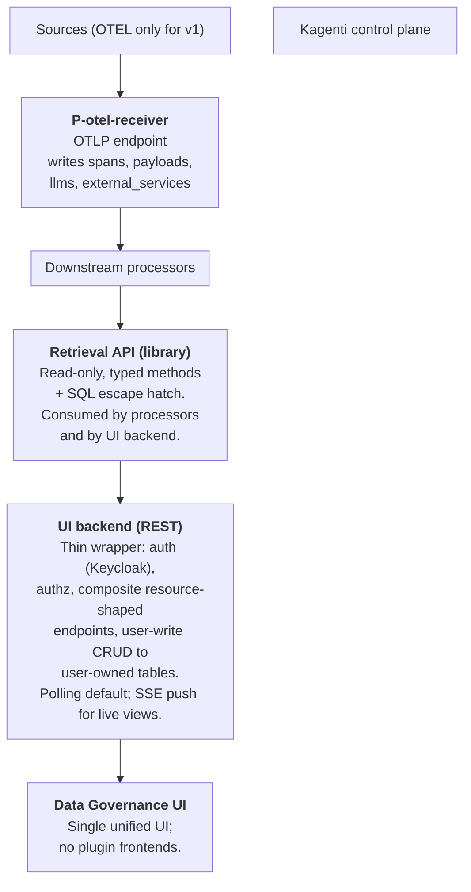

# Data Governance for Kagenti — Architecture (v2)

## Introduction

The data governance service aims to ensure data is accurate, secure, and used responsibly throughout an organization. It serves to establish visibility and control over how data flows through agents, tools, and systems. 

The primary objectives of data governance are:

- **Ensure data quality, transparency and traceability** — Maintain reliable information by tracking and recording how data flows through the system, and provide data lineage and classification so stakeholders understand how and what information moves through the system.
- **Detect data-related vulnerabilities and risks** — Identify and alert on potential vulnerabilities and policy violations (before they impact operations).
- **Enable compliance and remediation** - Provide clear explanations, remediation guidance and enforcement suggestions on policy violations.

## Guiding principles

- Minimal changes to the Kagenti platform itself.
- Loosely coupled with Kagenti.
- Build on existing open source (UDC for classification, OpenTelemetry /
  OpenInference for events, Postgres for storage, OPA/Rego as a likely
  first policy-plugin runtime).
- Use Kagenti's capabilities to pull information about installed agents,
  tools, namespaces, users.
- Store only raw events that are beneficial for later analytics.
- Raw events are normalized to a unified representation.
- Analytics work over raw events *and* a higher-level retrieval API.

## High-level architecture

`P-otel-receiver` is a trivial processor: it owns the OTLP socket,
stores incoming spans, and extracts derived entities (`llms`,
`external_services`) at first sighting.

Downstream processors are realtime; they read via the retrieval API
and mutate their own outputs when upstream rows change. Cursors are on
`change_seq` (insert+update aware); LISTEN/NOTIFY provides
push-latency.

## 1. Source and transport

- **Sources (v1): OTEL only.** The ingestion pipeline is
  source-pluggable in design, but only one source is implemented.
- **Transport: OTLP.** Kagenti's OTEL collector adds an exporter
  pointing at the data-governance ingestion endpoint. No other glue in
  the platform.
- **Auth-bridge sidecar is optional.** If present, it emits its own
  span with user attributes. Ingestion treats user identity as
  *enrichment*, not a join key — the pipeline works with or without
  the sidecar. Identity is joined at query time via trace_id.

## 2. Storage

- **Postgres**.

## 3. Span handling at ingest

Every incoming span is stored in `spans`. Ingest does not apply a
classification system to decide whether a span is semantic,
structural, or unknown; those distinctions are made downstream.

- **All spans are stored in `spans`.** This includes semantic spans,
  structural plumbing spans, and other spans.
- **Ingest is append-only and minimal.** `P-otel-receiver` writes the
  span row, preserves the OTEL parent linkage exactly as received, and
  extracts any span-derived entities (`llms`, `external_services`) at
  first sighting.
- **No rewrite of stored spans is required.** The `spans` table is the
  raw retained record.

## 4. Spans table and parent linkage

- Single append-only table: `spans`.
- `spans(trace_id, span_id, parent_id NULL, kind, name,
  service_name, started_at, ended_at, seq BIGINT, observed_at, ...,
  PRIMARY KEY (trace_id, span_id))`.
- **PK is composite `(trace_id, span_id)`**, not `span_id` alone.
  OTEL `span_id` is 8 bytes and only locally unique within a trace;
  two spans from different traces could in principle collide on
  `span_id`. Silently dropping a span on PK conflict is the worst
  failure mode, so the
  PK is composite. Across the schema, every reference to a span
  carries `trace_id` alongside `span_id`.
- `parent_id` is **nullable and not a foreign key**. It stores
  whatever the OTEL span carried as `parent_span_id`, even if the
  referenced span has not yet arrived (or never arrives).
  Out-of-order arrival is absorbed naturally. The implicit
  `(trace_id, parent_id)` referent is always within the same trace.
- All spans are stored at ingest.
- **`P-otel-receiver` is trivial:** append spans, upsert derived
  entities (`llms`, `external_services`) at first sighting, and do no
  parent-chain computation, fix-pass, or cross-trace coordination.

### Indexes

- `(trace_id, span_id)` — PK, implicit. Serves upward walks
  (resolving a known `parent_id` within the same trace).
- `spans(trace_id, parent_id)` — for downward walks (finding children
  of a given span within a trace).

## 5. Retention

- All spans are kept indefinitely in v1.
- Retention tiers and TTLs are a v2 concern.

## 6. Payloads

- Separate `payloads` table keyed by `content_hash` (SHA-256 of
  normalized payload).
- Every span that carries a payload stores `*_hash` columns
  (e.g., `prompt_hash`, `completion_hash`, `tool_input_hash`,
  `tool_output_hash`) referencing `payloads.content_hash`. **A
  payload is a whole message** — the entire LLM prompt blob, the
  entire tool input, the entire A2A message body — not a
  decomposition into per-message parts. Per-message decomposition
  is a future change (it would raise dedup hit rates and let
  classification attribute findings to individual messages), but
  v1 keeps the simpler one-blob-per-`*_hash` shape.
- `payloads(content_hash PK, content, size_bytes, truncated_bytes
  BIGINT NULL, first_seen_at)`. `truncated_bytes` is NULL for
  payloads stored in full; otherwise it records the original
  pre-truncation size in bytes.
- Written by `P-otel-receiver` alongside `spans`, in the same
  transaction.
- **Normalization is byte-preserving.** When classification
  lands, UDC returns findings as `(offset, length, entity_type)`
  tuples into the stored `content`, so any normalization step must
  not shift offsets. Concretely: if the payload arrives as JSON,
  store it verbatim (no key-order canonicalization, no whitespace
  stripping); content-hash is taken over the bytes as-stored. Two
  semantically-equal payloads with different byte representations
  get two `payloads` rows, which is acceptable — dedup is a size
  optimization, not a correctness requirement.
- **Per-payload size cap (v1): 100 KB.** A single oversized payload
  must not blow ingest memory or pollute Postgres with multi-MB
  rows. On overflow:
  - Truncate to the first 100 KB and store that as `content`.
  - Set `truncated_bytes` to the original byte length.
  - `content_hash` is computed over the *truncated* bytes, so two
    different oversized payloads that share their first 100 KB
    will dedup — accepted; this is the same "byte-equality only"
    posture as the rest of §6.
  - Span keeps its `*_hash` column populated normally; consumers
    detect truncation via `payloads.truncated_bytes IS NOT NULL`.
  - When classification lands, findings on a truncated
    payload are explicitly partial — UDC sees only the first
    100 KB.
- **Overflow observability.** First sighting of a truncation per
  `(span_name, service_name)` is logged in
  `payload_overflow_events(span_name, service_name, first_seen_at,
  last_seen_at, count)`: admin notification on first sighting,
  count-only thereafter.
- The 100 KB cap is provisional. §6 logs `size_bytes` on write so
  the distribution informs later tuning; raising or lowering the
  cap is a config change, not a schema change.

## 7. Entities

Entities are modeled as **per-kind typed tables**. A `entities` view
unions them for cross-kind queries. Per-kind tables:

- `namespaces` — authoritative, from Kagenti.
- `users` — authoritative, from Kagenti (backed by Keycloak). Humans.
- `agents` — authoritative, from Kagenti. Carries a `service_dns`
  column (in-cluster hostname / service address). Required for the
  reverse-lookup the T2A-vs-T2E and A2A-vs-A2E disambiguation depends
  on (§8).
- `tools` — authoritative, from Kagenti. Carries a `service_dns`
  column for the same reason as `agents`.
- `llms` — span-derived. Identity = `(provider, model_name)`.
  Optional `service_dns` / endpoint host, populated from the span
  when present, so the reverse-lookup "is this HTTP call hitting an
  LLM endpoint?" works when the OpenInference LLM span does not wrap
  its own HTTP client.
- `external_services` — span-derived. One row per observed external
  target system (filesystem, DB server, HTTP host, etc.). Identity =
  `(service_kind, identifier)` — `service_kind ∈ {http_host,
  db_server, fs_mount, ...}`, `identifier` kind-specific (host[:port]
  for `http_host`, etc.). Previously named `tool_targets`; renamed to
  `external_services` because both tools and agents can reach them.
  Fine-grained resource access (specific URLs, DB tables, files) can
  be tracked via span attributes, not in this table.

**Lifecycle columns:**

- K8s-sourced entities (`namespaces`, `users`, `agents`, `tools`):
  `valid_from`, `valid_until` (NULL = still active).
- Span-derived entities (`llms`, `external_services`): `first_seen_at`,
  `last_seen_at`. These never "disappear" — the UI can fade inactive
  nodes as a rendering choice, but there is no disappear event.

**Lifecycle model for K8s-sourced entities (versioned-row model):**

- `entity_id` is a per-row surrogate (UUID), **not** a stable logical
  identity. A delete-then-recreate of the same `(namespace, name)`
  produces a **new row with a new `entity_id`** and leaves the old
  row closed (`valid_until` set at the time of deletion).
- A logical "agent X" therefore corresponds to one or more `agents`
  rows ordered by `valid_from`. Queries can join to the *specific
  historical version* that was active at a given time by selecting
  the row whose `(valid_from, valid_until]` contains the timestamp
  (with NULL `valid_until` treated as +∞).
- Topology rendering merges versions by `(kind, namespace, name)` to
  show a single logical node per agent/tool, while the side panel can
  show per-version detail when a redeploy is interesting (e.g., for
  attributing behavior to a specific image tag). The merge key is a
  rendering choice in the UI, not a schema concept.
- A redeploy that replaces a pod without deleting the Kagenti CR is
  *not* a new row — that is a within-version observation. Only
  CR-level lifecycle transitions (create / delete) generate row
  boundaries. The discriminator used to detect "same logical entity,
  new row vs. continuing row" is the CR's
  resourceVersion-bracketed identity (`uid` from the K8s object
  metadata): a fresh `uid` after a previous delete is a new row; a
  stable `uid` across pod restarts is the same row.
- Past spans referencing a now-closed entity row remain valid
  forever. `valid_until` is **not** a soft-delete; it does not hide
  the row from queries.
- Namespace deletion sets `valid_until` on the namespace row only.
  Agents/tools within that namespace are closed by their own
  observation when they are next seen gone — not cascade-closed.

**Target granularity (for `external_services` and resource-level
analytics):**

- `external_services` is coarse-grained — one row per *system*
  (filesystem, DB server, HTTP host).
- Fine-grained resource access (specific files, tables, paths) can be
  tracked at the span level using span attributes.
- Resource-level analytics are aggregations over spans, not a
  separate table.

**Discovery:** span-derived targets use "first seen from a span" only —
no external inventory feeds.

## 8. Processor framework

### Processor list

| Processor | Input | Output | Notes |
|-----------|-------|--------|-------|
| `P-otel-receiver` | OTLP socket | `spans`, `payloads` | Trivial: append-only writes, no parent computation. |

The UI renders trace-scoped sequences directly from `spans`
filtered by `trace_id`.

### Realtime mutation model (Path 1)

Tree-shape-dependent processors emit **mutable outputs** in realtime.
Change propagation is Postgres-native:

- Every mutable table has a `change_seq BIGINT` column, maintained by
  a `BEFORE INSERT OR UPDATE` trigger that assigns
  `nextval('{table}_change_seq')`. Per-table sequences; no global
  counter.
- Downstream cursors are on **`change_seq`**, not on arrival seq. A
  single monotonic scalar captures both inserts and in-place updates.
- After a commit touching a table, the writing processor emits
  `NOTIFY {table}_changed`. Downstream uses `LISTEN` to wake and poll.
  Polling remains the fallback.
- **No external message bus.** The table is the change stream.

### Mutation cases each processor handles (v1)

Most processor outputs are append-only. The genuine mutation cases are:

- Entity tables (`agents`, `tools`, `namespaces`, `users`) have
  lifecycle updates via `valid_from` / `valid_until` columns.
- Span-derived entities (`llms`, `external_services`) update
  `last_seen_at` on repeated sightings.

**No hard deletes anywhere in the processor-output tables.** All
state transitions are inserts or updates. If a retraction ever becomes
necessary in the processor-output tables, the mechanism will be a
`deleted_at timestamptz NULL` column whose write bumps `change_seq` so
downstream sees it via the normal cursor.

### Framework invariants

- **Single writer per table.** No processor writes to another's output
  table.
- **Idempotent writes with deterministic keys.** Every output row has
  a key derived deterministically from its inputs. No hashing, no
  surrogate IDs where natural keys exist.
- **No per-row processor versioning.** Output rows do not carry
  `processor_version` / `processor_run_id` columns. A logic change
  that alters output semantics is handled by schema migration (drop
  and rebuild, or a targeted migration), not by per-row version tags.
- **Write-intents, not writes.** Processors return
  `[UpsertIntent(table, key, row), ...]`; the framework applies them.
  Enables future transparent remoting.
- **No direct DB reads.** Processors read through the retrieval API.
- **Explicit dependency declarations.** Processor declares its
  upstream dependencies.
- **In-process v1, concurrent tasks.** All processors are Python
  modules in one service, but they run as **separate asyncio tasks**
  with their own DB connections from a shared pool — *not*
  sequentially on the OTLP-receive callback. Specifically:
  - `P-otel-receiver` writes its outputs (spans, payloads, derived
    entities, counters) in one transaction per OTLP batch and
    returns to the socket immediately. Commit fires
    `NOTIFY spans_changed`.
  - Downstream processors run as separate tasks that wake on
    `LISTEN spans_changed` (and `agents_changed` / `tools_changed`
    for entity updates).
  - **No synchronous backpressure from downstream processors to the
    receiver.** If downstream processing lags, `spans` simply grows
    ahead of downstream processors; the cursor-lag alert (below) is the
    operational signal.
  - Promoting any downstream processor to a separate OS process is
    a deployment-only change — the table-as-message-bus design
    already accommodates it.
- **Monotonic integer seq for raw events.** `spans.seq BIGINT` assigned
  on ingest. All cursors are integers.

### Execution model

- **Pull with watermarks** as the base model. Each processor maintains
  a `last_processed_change_seq` (or `last_processed_seq` for
  append-only inputs like `spans`) per upstream table.
- **Postgres LISTEN/NOTIFY** for low-latency wake-ups. Push-latency
  measured in milliseconds end-to-end.
- `P-otel-receiver` is exempt from the cursor pattern (socket input).

### Cursor lag as an operational signal

- Processor cursor state is tracked in `processor_cursors(processor_id,
  upstream_table, cursor, updated_at)`.
- A stuck processor blocks its dependents, which is correct behavior —
  but needs monitoring. "Alert when any processor's cursor age exceeds
  N minutes" is required from day one.

## 9. Retrieval API

- **Read-only.** Writes go through the processor framework (processors)
  or the UI backend (user inputs).
- **Shape: typed methods + SQL escape hatch.** 95%-path methods like
  `get_spans(trace_id) -> list[Span]`,
  `iter_spans(cursor, limit)`, `get_flow_edges(trace_id)`. Escape
  hatch for genuinely ad-hoc needs; promote to typed method when used
  twice. Invocation-shaped retrieval methods can be added as needed.
- **Cursors are monotonic integers.** No opaque tokens. Methods over
  mutable tables cursor on `change_seq`; methods over append-only
  tables cursor on `seq`.
- **Time semantics:**
  - Every retrieval method accepts `(time_from, time_to)`.
  - `time_to = NULL` → "up until now."
  - Snapshot queries = `time_from == time_to` or degenerate range.
  - Validity intervals (`valid_from`, `valid_until`) only on
    K8s-sourced authoritative entities; everything else uses
    `first_seen_at` / `last_seen_at` or event timestamps.
- **Versioning per method, not per API.** Evolve one method at a time.

## 9a. UI rendering posture for spans

The UI renders **spans as edges between entities** in a topology
view (§11). Spans can be aggregated and filtered based on their
attributes and relationships to provide meaningful visualizations.

When a user clicks an edge, a **side panel** lists the raw spans
associated with that edge as a flat list (ordered by `started_at`).
This keeps the topology view clean and allows users to drill down
into span details as needed.

## 10. UI backend

- **Thin REST wrapper.** Auth (Keycloak), authz, composite read
  endpoints, user-write CRUD. No business logic beyond auth/authz.
- **Resource-shaped composite endpoints, not page-shaped.**
  `GET /traces/{id}?include=spans` — one round-trip per view
  of a resource.
- **Expansion parameters** control depth; default sensibly, allow opt-out
  of heavy fields.
- **Composite endpoints use the retrieval API internally.** Same read
  logic path as processors.
- **User writes** go directly to user-owned tables (`user_reviews`,
  `violation_acknowledgments`, `classification_overrides`, ...). These
  tables are owned by the UI backend, not by any processor — a
  deliberate carve-out from "processors own all tables."
- **Live updates:** polling by default; SSE push for the few views
  where live tailing is valuable (raw events, live sequence diagram).
  SSE consumes the same LISTEN/NOTIFY channels the processor framework
  already uses.

## 11. Topology API

`GET /topology/{from}[/{to}]`.

- **Semantics of from/to:**
  - Both omitted → latest snapshot (current state).
  - `from == to` → snapshot at that timestamp.
  - Both set (different) → time-ordered stream of graph mutations in
    the interval; UI can replay at user-chosen pace.
  - Only `to` set → full history from earliest stored entity up to
    `to`.
  - Only `from` set → initial state at `from` + events in `(from, now]`.
- **Element shape:** unified envelope `{ts, op, kind, id, payload}`
  with documented per-(kind, op) payload schemas. `op ∈ {appear,
  disappear, update}`, `kind ∈ {node, edge, overlay}`.
- **Server-side production:** views/UNION over authoritative tables
  (`v_topology_entity_events`, `v_topology_span_events`,
  `v_topology_overlay_events`). No separate events table. If slow,
  promote to refreshable materialized view later.
- **Transport:** cursor-based pagination (v1).

### Overlays

Overlays combine **both** kinds of information:

- Visual-property modifications on existing nodes/edges (e.g., color an
  agent node red because a risk analytic flagged it).
- Entirely new visual elements not in the base graph (e.g., a warning
  icon positioned near a node).

Overlays are produced by processors writing to their own output tables;
the topology events view projects them into the overlay event kind.

## 12. Processors (terminology)

**Processors** — are headless data transformers. There is one unified UI
that reads from processor outputs. Overlays remain as a processor output,
consumed by the UI's topology view.

## Open questions

- **Exact attribute schemas for span analysis.** Span attributes
  (`server.address`, `url.full`, `openinference.llm.provider`, etc.)
  need to be documented for consistent processing across the system.
- **`service_dns` population on `agents` / `tools` / `llms` (§7).**
  How the in-cluster service DNS of an agent or tool is obtained, and
  whether `llms.service_dns` is observable from configuration or only
  from LLM span attributes.
- **Genuinely-missing spans.** Spans that never arrive in the system
  (dropped in transit, lost on crash, never emitted due to a framework
  bug) can leave gaps in trace analysis. If operational experience
  shows meaningful gap rates, a bounded-time handling strategy will be
  needed.
- **What counts as a payload vs. metadata** — i.e., which span
  attributes should be stored as payload references via `*_hash` fields
  versus inline attributes. (The orthogonal questions are settled: size
  cap is 100 KB with truncation per §6; normalization is byte-preserving
  per §6; v1 stores whole-message payloads, not per-message parts.)
- **Concrete schemas for user-owned tables** (`user_reviews`,
  `violation_acknowledgments`, `classification_overrides`).
- **Retrieval API concrete method surface** given the finalized table
  layout.
- **Storage / retention policy** for when Postgres starts feeling
  crowded.
- **Authorization model for the UI backend** (namespace-scoped RBAC
  vs "all authenticated users see everything").
