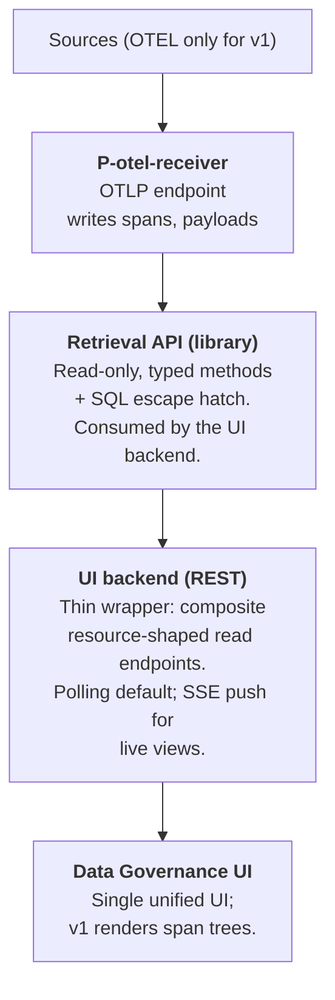

# Data Governance for Kagenti — Architecture (v2)

## Introduction

The data governance service aims to ensure data is accurate, secure, and used responsibly throughout an organization. It serves to establish visibility and control over how data flows through agents, tools, and systems.

The primary objectives of data governance are:

- **Ensure data quality, transparency and traceability** — Maintain reliable information by tracking and recording how data flows through the system, and provide data lineage and classification so stakeholders understand how and what information moves through the system.
- **Detect data-related vulnerabilities and risks** — Identify and alert on potential vulnerabilities and policy violations (before they impact operations).
- **Enable compliance and remediation** - Provide clear explanations, remediation guidance and enforcement suggestions on policy violations.

## Guiding principles

- Minimal changes to the Kagenti platform itself.
- Loosely coupled with Kagenti.
- Build on existing open source (OpenTelemetry / OpenInference for
  events, Postgres for storage).
- Store only raw events that are beneficial for later analytics.

## High-level architecture



**v1 ingestion is one processor.** `P-otel-receiver` owns the OTLP
socket and writes every received span plus its payloads to Postgres.
Nothing is filtered, classified, normalized into interactions, or
correlated against an entity inventory. The v1 UI renders raw span
trees grouped by `trace_id`, with payload inspection on click.

## 1. Source and transport

- **Sources (v1): OTEL only.** The ingestion pipeline is
  source-pluggable in design, but only one source is implemented.
- **Transport: OTLP, both gRPC and HTTP/protobuf.** The receiver
  opens both standard ports (4317 gRPC, 4318 HTTP). This matches
  what most OTel collector exporters speak out of the box and avoids
  forcing collector reconfiguration to point at us. Kagenti's OTEL
  collector adds an exporter targeting one of the endpoints; no
  other glue in the platform.

## 2. Storage

- **Postgres.**
- **No Phoenix dependency.** Ingestion is a parallel OTel sink; raw
  spans are stored by us, not read from Phoenix.

## 3. Spans table and parent linkage

- Single append-only table: `spans`.
- `spans(trace_id, span_id, parent_id NULL, kind, name, service_name,
  started_at, ended_at, status_code, status_message NULL,
  openinference_span_kind NULL, attributes jsonb,
  events jsonb, links jsonb,
  seq BIGINT, observed_at,
  PRIMARY KEY (trace_id, span_id))`.
- **PK is composite `(trace_id, span_id)`**, not `span_id` alone.
  OTEL `span_id` is 8 bytes and only locally unique within a trace;
  two spans from different traces could in principle collide on
  `span_id`. Silently dropping a span on PK conflict is the worst
  failure mode, so the PK is composite. Every reference to a span
  carries `trace_id` alongside `span_id`.
- `parent_id` is **nullable and not a foreign key**. It stores
  whatever the OTEL span carried as `parent_span_id`, even if the
  referenced span has not yet arrived (or never arrives).
  Out-of-order arrival is absorbed naturally. The implicit
  `(trace_id, parent_id)` referent is always within the same trace.
- **`P-otel-receiver` is trivial:** append spans + payloads, applying
  only the blocklist filter (§3.1). No parent-chain computation, no
  fix-pass, no cross-trace coordination.
- `seq BIGINT` is assigned monotonically on ingest for cursor-based
  retrieval over append-only spans.

### Attribute typing

OTLP attribute values are mapped to JSON types directly:
string→string, int/double→number, bool→bool, array→array. The
int-vs-double distinction is lost (JSON has only `number`); this is
acceptable for v1 and matches what most OTLP-to-JSON consumers do.

### Span events and links

OTLP span `Event` records (e.g. exceptions) are stored verbatim in
the `events jsonb` column as an array of `{name, time_unix_nano,
attributes}` objects. Span `Link` records are stored similarly in
`links jsonb` as an array of `{trace_id, span_id, attributes}`
objects. Both default to `NULL` when the span has none, which keeps
row size lean for the common case.

### Promoted attributes

Three attributes are promoted to dedicated columns because v1 UI
grouping/coloring or filtering depends on them; everything else
lives in the `attributes jsonb` blob and can be promoted later
without breaking the schema.

- `status_code`, `status_message` — OTLP span status. Every span has
  a status; the UI marks errors based on it.
- `openinference_span_kind` — populated from the
  `openinference.span.kind` attribute when present, NULL otherwise.
  Stable discriminator for LLM / TOOL / AGENT spans across the
  framework jungle (see "Open questions"); the v1 UI uses it for
  grouping and coloring.

`service.name` is already a column (`service_name`). `service.namespace`,
HTTP attributes, and everything else stay in `attributes jsonb` for v1.

### Transactional unit

**One transaction per span.** A poison span aborts only its own
write; neighbours commit. Per-span commit overhead is acceptable at
v1 volumes; this is reconsidered if profiling shows commit cost
dominating ingest latency.

**Duplicate handling:** `INSERT ... ON CONFLICT (trace_id, span_id)
DO NOTHING`. First writer wins; subsequent arrivals with the same
`(trace_id, span_id)` are silently dropped. OTLP retries (which can
re-deliver the same span after a network blip) are therefore
idempotent. No update path in v1.

### Indexes

- `(trace_id, span_id)` — PK, implicit. Serves upward walks
  (resolving a known `parent_id` within the same trace).
- `spans(trace_id, parent_id)` — for downward walks (finding children
  of a given span within a trace).

## 3.1 Ingest blocklist

The receiver applies a hardcoded blocklist of span-name patterns
before writing. Spans matching any pattern are dropped at the socket
without touching `spans` or `payloads`.

- **Pattern grammar:** exact names *or* `prefix*` glob — nothing
  else. Two-case grammar is easy to scan in PR review and makes the
  blocklist's behavior obvious from reading the entries. Regex /
  attribute predicates are out of scope; if a noisy span needs more
  than name-prefix matching to identify, that's a sign the
  instrumentation should be fixed upstream rather than worked
  around in the blocklist.
- **Form:** a Python module listing the patterns; reviewed by PR.
  Not configurable at runtime.
- **Initial entries:** Kubernetes liveness/readiness probe spans,
  `/metrics` scrape paths, the receiver's own self-spans (if it
  instruments itself).
- **Counts:** dropped spans are tallied in a small
  `blocked_span_counts(pattern, count, last_seen_at)` table for
  observability. No per-span row is kept.
- **Why hardcoded.** The blocklist is small, slow-changing, and
  load-bearing for ingestion volume. Operator-editable config would
  invite ad-hoc filtering choices that diverge from what the UI and
  any future processors expect.

## 4. Payloads

- Separate `payloads` table keyed by `content_hash` (SHA-256 of
  payload bytes).
- Every span carries two payload reference columns:
  `request_payload_hash NULL` and `response_payload_hash NULL`,
  each referencing `payloads.content_hash`. **A payload is a
  whole message** — the entire LLM prompt blob, the entire tool
  input, the entire A2A message body — not a decomposition into
  per-message parts.
- **Generic request/response, not span-kind-aware.** The receiver
  does not interpret span semantics in v1: it locates payloads via
  two hardcoded ordered lists of attribute names — one for
  request-shaped attributes (e.g. `input.value`, `gen_ai.prompt`,
  the A2A SDK's request attributes), one for response-shaped
  (e.g. `output.value`, `gen_ai.completion`, the A2A response
  attributes). The lists are reviewed by PR alongside the blocklist.
  Mapping "prompt" vs "tool input" vs "A2A message" semantically is
  the job of a future classifier; v1 only knows "this attribute
  looked like a request body, that one looked like a response body".
  Spans with no recognized payload attributes get NULL on both columns.
- **Multiple matches per direction are wrapped in a JSON array.** If
  a span carries more than one request-shaped attribute (e.g. both
  `input.value` and `gen_ai.prompt`), the receiver collects the
  matched values in list order and stores `[v1, v2, ...]` as the
  payload `content`. Same rule for response-shaped attributes. The
  array form is self-describing, decomposable downstream, and
  consistent with the JSON-canonicalization pipeline below.
  **For consistency, single matches are wrapped too** — a span with
  one matched request attribute stores `[v1]`, not the bare value.
  This costs one set of brackets per payload and pays back by
  letting every consumer assume the same shape.
- `payloads(content_hash PK, content, size_bytes, truncated_bytes
  BIGINT NULL, first_seen_at)`. `truncated_bytes` is NULL for
  payloads stored in full; otherwise it records the original
  pre-truncation size in bytes.
- Written by `P-otel-receiver` alongside the owning span, in the
  same transaction.
- **Hashing rule (v1):** the receiver attempts canonicalization
  (parse as JSON, sort keys, minify) only when the input size is at
  or below the per-payload cap; oversized inputs skip
  canonicalization and take the byte-hash + truncate path.
  Canonicalization is best-effort: parse failure falls back to the
  byte-hash path silently. When canonicalization succeeds, `content`
  stores the canonical form and the hash is over canonical bytes.
  This bounds canonicalization cost to the cap, raises dedup hit
  rates for the common case (LLM prompts, A2A message bodies), and
  keeps the oversized path simple — a 5MB JSON blob doesn't get
  parsed just to be truncated afterward.
- **Per-payload size cap (v1): 10 KB.** A single oversized payload
  must not blow ingest memory or pollute Postgres with multi-MB
  rows. On overflow:
  - Truncate to the first 10 KB and store the truncated raw bytes
    as `content` (no canonicalization on the oversized path).
  - Set `truncated_bytes` to the original byte length.
  - `content_hash` is computed over the *truncated* bytes, so two
    different oversized payloads that share their first 10 KB
    will dedup — accepted; this is the same "byte-equality only"
    posture as the rest of §4.
  - Span keeps its `*_hash` column populated normally; consumers
    detect truncation via `payloads.truncated_bytes IS NOT NULL`.
- The 10 KB cap is provisional. `size_bytes` is logged on write so
  the distribution informs later tuning; raising or lowering the cap
  is a config change, not a schema change.

## 5. Retention

- **v1 keeps everything.** No TTL, no tiering, no aging.
- "Postgres fills up" is treated as a documented operational
  constraint of v1, not a design failure: v1 is a development /
  demo deployment, not a long-running production system. Operators
  monitor disk and recycle the database when needed.
- Retention tiers, time-based TTLs, classification-based tiering,
  and payload-keep-but-span-drop strategies are all v2 design
  problems. They depend on the later increments (classification, an
  entity inventory) to make tier-defining choices.

## 5.1 Receiver runtime observability

The receiver exposes a healthcheck endpoint and a Prometheus metrics
endpoint. This is a v1 operational requirement, not implementation
detail — the contract is pinned here so deployments can rely on it.

- **`GET /healthz`** — returns 200 when the receiver is accepting
  OTLP and can reach Postgres; 503 otherwise.
- **`GET /metrics`** — Prometheus exposition. Required metrics:
  - `spans_received_total{transport}` — counter, OTLP spans
    received per transport (`grpc`/`http`).
  - `spans_blocked_total{pattern}` — counter, spans dropped by
    the §3.1 blocklist, labelled by matched pattern.
  - `spans_inserted_total` — counter, spans successfully written.
  - `spans_duplicate_total` — counter, ON CONFLICT DO NOTHING hits.
  - `span_insert_duration_seconds` — histogram of per-span insert
    latency.
  - `payloads_inserted_total` / `payloads_duplicate_total` —
    counterparts for the `payloads` table.
  - `payload_truncations_total` — counter, payloads exceeding the
    10 KB cap.
  - `db_errors_total{kind}` — counter, Postgres errors by kind
    (connection, integrity, other).

## 6. Retrieval API

- **Read-only.** v1 has no writers other than `P-otel-receiver`.
- **Shape: typed methods + SQL escape hatch.** 95%-path methods like
  `iter_spans(cursor, limit)`, `get_trace(trace_id) -> list[Span]`,
  `list_recent_traces(time_from, time_to, limit, offset)`,
  `get_payload(content_hash) -> Payload`. Escape hatch for genuinely
  ad-hoc needs; promote to typed method when used twice.
- **SQL escape hatch is library-only.** It is reachable from Python
  callers (the UI backend, future processors, ad-hoc analytics in a
  REPL or notebook) but is not exposed through the UI backend's
  REST surface. The UI backend uses only typed methods.
- **Cursors are monotonic integers.** No opaque tokens. Methods over
  `spans` cursor on `seq`.
- **Time semantics:**
  - Every retrieval method accepts `(time_from, time_to)`.
  - `time_to = NULL` → "up until now."
  - Snapshot queries = `time_from == time_to` or degenerate range.
- **Versioning per method, not per API.** Evolve one method at a time.

## 7. UI backend

- **Thin REST wrapper.** Composite read endpoints. No business logic
  beyond request shaping.
- **Resource-shaped composite endpoints, not page-shaped.**
  `GET /traces/{id}` returns the trace's spans in one round-trip;
  `GET /traces` returns the recent-traces listing.
- **Expansion parameters** control depth; default sensibly, allow
  opt-out of heavy fields (notably payload bodies).
- **Composite endpoints use the retrieval API internally.**
- **Live updates:** polling by default; SSE push for live-tail views
  (raw events) when needed.

### Recent-traces listing

`GET /traces` returns recent traces ordered by their listing-root
span's `started_at`, paginated. Every trace contributes exactly one
row to the listing, even if its true OTLP root never arrived
(dropped by the blocklist, lost in transit, or simply not yet
ingested when the listing query ran).

The **listing root** is computed per trace as follows:

1. If the trace has any span with `parent_id IS NULL`, the earliest
   such span is the listing root and the row carries
   `is_complete_root = true`.
2. Otherwise, the trace has only spans whose `parent_id` does not
   resolve within the trace ("orphan" spans). The earliest such
   orphan is treated as the listing root and the row carries
   `is_complete_root = false`. The UI marks these as "span with
   missing parent" and offers a filter to show/hide them.

Sketch:

```sql
WITH ranked AS (
  SELECT
    s.trace_id,
    s.span_id,
    s.parent_id,
    s.started_at,
    s.name,
    s.service_name,
    (s.parent_id IS NULL) AS is_real_root,
    ROW_NUMBER() OVER (
      PARTITION BY s.trace_id
      ORDER BY (s.parent_id IS NULL) DESC, s.started_at ASC
    ) AS rn
  FROM spans s
  WHERE s.observed_at >= $time_from AND s.observed_at < $time_to
)
SELECT
  trace_id,
  started_at         AS root_started_at,
  name               AS root_name,
  service_name       AS root_service_name,
  is_real_root       AS is_complete_root,
  (SELECT COUNT(*) FROM spans WHERE trace_id = ranked.trace_id) AS span_count
FROM ranked
WHERE rn = 1
ORDER BY root_started_at DESC
LIMIT $limit OFFSET $offset
```

(The `ROW_NUMBER` partitioning prefers any `parent_id IS NULL` span
over any orphan span, then breaks ties by `started_at`.)

No `traces` summary table is maintained — the listing query runs
over `spans` directly. This is acceptable at v1 volumes; if profiling
shows it dominating UI latency at production scale, the typical
remediation is a refreshable materialized view, which is a v1.x
addition that does not change the schema or the receiver.

### Authentication and exposure (v1)

The OTLP receive socket and the UI backend are **unauthenticated**
in v1. Both are intended to run cluster-internal, with a Kubernetes
NetworkPolicy restricting access to the Kagenti namespace.
Production exposure (external auth, RBAC, mTLS) is a v2 concern;
running v1 outside an isolated cluster is unsupported.

## 8. UI

The v1 UI is a single page with two views:

- **Recent traces** — paginated list backed by `GET /traces`. Each
  row shows `root_service_name`, `root_name`, `root_started_at`,
  span count, an error indicator if any span has a non-OK
  `status_code`, and a "missing parent" badge when
  `is_complete_root = false`. A filter toggle lets the user hide
  traces whose listing root is a missing-parent orphan. Clicking a
  row opens the trace tree.
- **Trace tree** — spans of a single trace grouped by `trace_id` and
  linked by `parent_id`. Spans are colored by
  `openinference_span_kind` when present, marked with an error icon
  on non-OK `status_code`. Clicking a span opens a detail panel
  showing its attributes, events, links, and any referenced
  payloads (fetched by `content_hash`).

No topology view, no sequence diagrams, no classification overlays —
those return when the corresponding processors are designed in a
later increment.

## Open questions

- **Per-payload size cap.** Provisional 10 KB; the cap is a backstop
  against pathological inputs, not a tuned number. Observed
  `size_bytes` distribution in production will inform adjustment.
  Raising or lowering it is a config / single-line change, not a
  schema change.
- **`openinference.span.kind` reliability.** The promoted column
  assumes this attribute is consistently emitted by Kagenti agent
  frameworks. Demo traces support it, but spans from custom agents
  or non-OpenInference instrumentation may leave the column NULL,
  degrading the v1 UI's grouping. Acceptable for v1; reconsidered
  if NULL rate is high in production.
